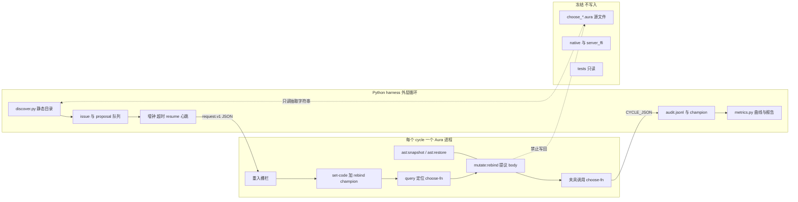
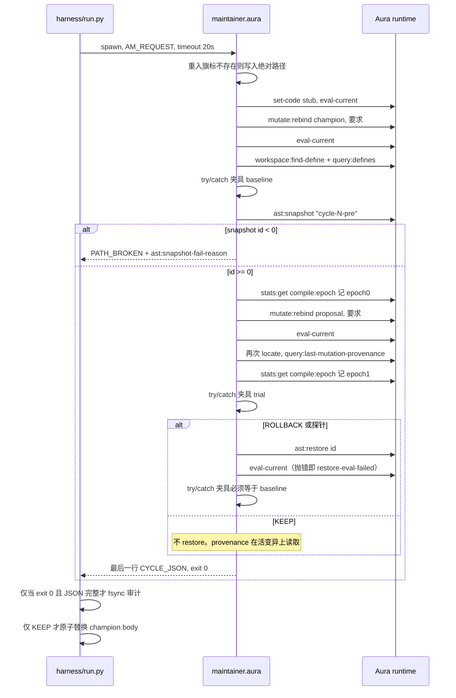

# Aura Maintainer v1：无 LLM 的长时程策略维护循环

| 字段 | 值 |
| --- | --- |
| 文档 | Aura Maintainer v1 Design |
| 作者 | Aura Maintainer |
| 日期 | 2026-10-07 |
| 状态 | Draft |
| 目标仓库 | `/home/dev/code/grok-dev/aura-maintainer` |
| 运行时钉扎 | `target/aura-redis/AURA_REF` = `b0c6b3555e4287c8807b019a8b9316ee94c988b6` |
| 实现语言 | 设计说明为中文；路径、标识符、API、代码、PR 标题保持英文 |

## Overview

v1 在 Aura 上跑一个可恢复的维护循环，对象是 aura-redis 的 **Aura 控制面策略**，不是 C 数据面，也不是「谁来提议补丁」。循环对一个真实的中型树（`target/aura-redis`）做数十到数百次 `snapshot → mutate → verify → keep/rollback → record`，并留下可查询的审计。24–72 小时是外层守时，不是无限生成新补丁。

提议（`propose`）在 v1 **不得调用 LLM**。候选来自闭集：已有 `choose_*.aura` 策略体互换、三个数值旋钮的有界步进、以及由此生成的 lambda 字符串。运行时路径只用已经在钉扎版本里存在的原语：`set-code`、`mutate:rebind`、`ast:snapshot`、`ast:restore`、`query:defines`、`(query :find …)`、`workspace:find-define`、`query:last-mutation-provenance`，以及 `std/hot-strategy` 的 `register!` / `heal!`（见下文对 `swap!` 布尔值的不信任）。`agent/maintainer.aura` 里的 `(ast:rollback "pre-mutate")` 在钉扎运行时 **不存在**。回滚是 `(ast:restore <integer-id>)` 之后再 `(eval-current)`：直接路径只把快照 `FlatAST` 拷回 workspace，不重绑 `top_env` 里的活闭包。可调用的证明是重绑之后的闭包，不是恢复出来的 AST 字节本身。

可度量的 KEEP 不是「测试还绿」，而是：在一份冻结的窗口夹具上，champion 的 `choose-fn` 得分严格上升，且软预算行没有违规。夹具的金标准是 **源码里的** `*policy-choose-normal*`，不是 README 里已经过时的散文。这个得分 **不是** Redis hit%。`flash_churn` / `mutation_gain` 跑在另一个进程 `policy_agent.aura` 里，不会自动装上本代理 KEEP 下来的 body，v1 不把它当作 KEEP 门禁。

## Background & Motivation

### 现在仓库里有什么

`README.md` 与 `docs/design.md` 把 v0 定义成 discover → locate → propose → mutate → verify → keep/rollback → record，成功标准是 ≥24 小时、多次 KEEP、失败能回滚、审计可查询。非目标已经写明：不碰整个 Aura 运行时、不保证测试之外的语义正确、不做无人值守的公开 Redis、不把 C 数据面当主路径。代码还没接上这些句子。

`agent/maintainer.aura` 要求了 `std/mutate` 与 `std/hot-strategy`，但 `discover` 恒返回 `'()`，`locate` / `propose` 返回 `#f`，`verify` 恒 `#t`。`run-one-cycle` 在没有 `set-code` 的情况下调用 `(ast:snapshot "pre-mutate")`。钉扎实现里，workspace 未建立时 `ast:snapshot` 返回 `-1`，原因经 `(ast:snapshot-fail-reason)` 给出：`:guard-reject`、`:no-workspace` 或 `:empty-source`（`evaluator_primitives_ast.cpp`，注释写明 top-level `define` 不会填充 `workspace_flat_`）。随后的 `(ast:rollback "pre-mutate")` 不是已注册原语（全仓库只有注释提到这个名字）。`run` 在 discover 为空或 propose 为 `#f` 时 **直接停**，按现状一次真实扫描就会结束，撑不满 24 小时。

`harness/run.py` 接受 `--cycles`，但从不传给 Aura。它把 `AURA_SANDBOX=off`、`AURA_PIPELINE_STRICT=0` 放进环境，启动一次 `aura agent/maintainer.aura`，再把以 `AUDIT ` 开头的文本刮进 jsonl。`harness/metrics.py` 只数 `KEEP` 与 `ROLLBACK`。`.gitignore` 只忽略 `reports/*.json` 与 `reports/*.log`，忽略不了 jsonl 和子目录。

### 目标树上已经证明的路径

aura-redis 的产品分界写在 `docs/aura-native-control.md` 与 `src/redis/policy/README.md`：

- C `aura_redis_server` 执行具名内核（`lru` / `lfu` / `noop` / `ttl_aware` / `slru` / …）。
- `policy_agent.aura` 把 `choose-fn` 放进 **workspace**，用 `hot-strategy` / `mutate:rebind` 换 body 字符串，再经 RESP `EVICT` / `LAYOUT` 下发。
- `choose_*.aura` 导出的是 **字符串**，不是可被 `query:*` 直接改写的活 lambda。`policy_agent` 先

```aura
(set-code "(define (choose-fn dgets dsets dhits dmisses devicted nkeys dexpired avg_ttl keys_ttl) \"\")")
(eval-current)
(hot-strategy:register! "choose-fn" *policy-choose-normal*)
(hot-strategy:swap! "choose-fn" *policy-choose-normal* "seed-normal")
```

见 `policy_agent.aura` 约 1854–1865 行。`build-threshold-body` / `do-fitness-threshold-mutate!`（约 932–996 行）与 `evolve-apply-body!`（约 1031–1047 行）已经演示了「拼一个 lambda 字符串 → `mutate:rebind`」这种有界参数变异。M11 的叙事就是坏阈值播种、适应度上升才 keep（`docs/high-roi-iterations.md`）。

`tests/test_hot_strategy_policy.aura` 是纯 Aura、不启 Redis 的冒烟，但它相对当前 body **已经漂移**：`set-code` 的 stub 只有 4 个形参；调用是 `(choose-fn 10 100 5 5)`；期望精确等于 `"lfu"` / `"lru"`。当前 `choose_normal.aura` 的 lambda 是 9 个形参，写重返回 `"lfu|flat|pin"` 或 `"lfu|flat"`，读重返回 `"lru|flat"`。该测试 **不能** 当 v1 的通过门禁。

同一文件头部注释（`choose_normal.aura` 第 9–12 行）写「`erate ≥ 50` → `noop|flat`」。`cond` 里只有 `(>= erate 20)`，没有 50 的分支。`src/redis/policy/README.md` 与 `docs/workloads.md` 仍写写重 → `lfu|hot_cold`。**合同以 body 字符串为准。** v1 检测这些漂移，但不自动改注释、README 或测试。

### 钉扎 stdlib 与 HEAD 的差异（必须写进实现，否则会误判）

`AURA_REF` 上的 `lib/std/hot-strategy.aura` 中，`hot-strategy:swap!`：

- 不检查 `mutate:rebind` 的返回值是不是精确的 `#t`（拒绝时原语返回的是错误对象，往往为真）；
- `(try (eval-current) (catch (e) #t))` 把 `eval-current` 的失败当成成功；
- 成功后把 `*hs-last-good-body*` 设为 **新** body，把 `*hs-last-good-snap*` 设为 **swap 之前** 的快照 id。body 与 snap 指向的不是同一状态。

工作区里的 `/home/dev/code/aura` HEAD（`0ba8690e…`）已按 issue #4275 收紧：只有 `(equal? rebound #t)` 且 `eval-current` 不抛才晋升 last-good。harness 找到的二进制可能是二者之一。v1 的判定 **不得** 读取 `swap!` 返回的布尔值作为「body 已干净装上」。自有快照 id + `(equal? (mutate:rebind …) #t)` + 调用探针才算数。KEEP/ROLLBACK 的恢复以自己的 `ast:snapshot` id 为准：`(ast:restore id)` 成功之后必须 `(eval-current)`，抛错即 `PATH_BROKEN` `reason=restore-eval-failed`。钉扎 `mutate:rebind` 在返回 `#t` 之前会 `eval_flat` 该 define 并 `tenv.bind`（`evaluator_primitives_mutate.cpp`，issue #2730），所以 trial 闭包已经进了 `top_env`。`ast:restore` 的直接路径只 copy-assign 快照的 `FlatAST`/`StringPool`，标脏，并调用 `pre_cache_workspace_defines_fn_`（注释写明这是 dep-graph 与 IR cache，不是 `eval_flat`）。它不重绑 `top_env`。源串回退路径只是 `set-code`，同样要等下一次 `eval-current` 才求值。钉扎 `hot-strategy:heal!` 因此在 `ast:restore` 成功后还做 `(try (eval-current) (catch (e) #f))`，而且即使 `eval-current` 抛了仍返回 `#t`。v1 不把 `heal!` 的布尔值当恢复成功。`heal!` 只在 `ast:restore` 本身返回 `#f` 时作为 broken 探针的第二手段，并且其后仍然要裸调用 `eval-current`（不吞异常）再跑夹具。

`policy_agent.aura` 文件头写明：在这个 Aura 修订上，`eval-current` 会重入当前文件，所以才有 `.ar-agent-booted-<port>.flag`。维护代理必须有同类的重入栅栏，且旗标路径必须在 `reports/` 下的绝对路径，不能像 policy agent 那样把 `.ar-agent-booted-*.flag` 写进 `target/aura-redis` 的 cwd。

### 痛点

长时程维护要的是：变异点精确、失败能回到同一 AST、审计能回答谁在何时为何改了什么、增量编译真的发生过。提议从规则来还是以后从 LLM 来，是可替换的后端。v0 既没有真实变异，也没有可恢复的外层循环；若直接上 LLM，失败无法归因于「坏提议」还是「Aura 路径坏了」，也无法复现。

## Goals & Non-Goals

### Goals（v1 必须交付）

1. 外层可跑满给定的 cycle 上限或墙钟（演示档 24h，上限 72h），进程崩溃不毁掉已 fsync 的审计，也不把 `target/aura-redis` 的已跟踪源文件改脏。
2. 每个 cycle 只绑定 **一个** issue、**一个** proposal。
3. 闭集提议：策略互换、三旋钮步进、invert/broken 探针。无网络、无 LLM、无密钥文件。
4. 三类结果分开计数：探针（路径成立）、改进（夹具分严格上升才 KEEP）、拒绝（ROLLBACK）。`choose_broken` 永远不能 KEEP；`choose_inverted` 只是效应探针。
5. 审计为版本化 JSONL，能用一个 Python 报告区分 `proposal:` 拒绝与 `PATH_BROKEN`。
6. 质量曲线：每个 cycle 一行 champion 夹具分，KEEP 才改变分数，ROLLBACK / IDLE 不改变。
7. `recover` 模式从故意变差的模板播种，沿旋钮梯子至少产生一次夹具分上升的 KEEP。`hold` 模式从与 `choose_normal` 字节级相同的 body 播种，KEEP 数必须为 0。

### Non-Goals（v1 明确不做）

与 `docs/design.md` 现有非目标一致，并收紧：

- 不调用 LLM。不读 `~/code/keys/minimax`。MiniMax M3 只作为以后的 `propose` 后端接口出现。
- 不改 C 数据面：`target/aura-redis/native/**`、任何 `.c` / `.h` / `.so`、RESP 实现、`server_ffi.aura`。
- 不改 `adaptive.aura` / `adaptive_body.aura`。它们是 FFI 监督器路径（4 参 `adaptive-choose`，`*ad-min-ops*` = 40），`adaptive.aura` 自己写明 hot-strategy 不在这个文件里。本修订上大量 `(c-func)` 与用户闭包不能放在同一 workspace。
- 不把 `policy_agent.aura` 整文件 `set-code` 进 workspace（约三千行，且 `eval-current` 会重入）。不在 v1 给它加 `AURA_REDIS_CHOOSE_BODY_FILE`。
- 不改测试文件来「修绿」。`tests/**` 是只读检测对象。
- 不把夹具分说成 hit%、regret 或覆盖率。不跑 `tests/test_prod_*.py`、`ci-prod.sh`、`phase_marathon` 作为每 cycle 门禁。
- 不保证测试之外的语义正确。不做无人值守的公开 Redis。不替换人工评审。
- 不做 `mutate:replace-pattern`、`mutate:rename-symbol`、`mutate:set-body`、`mutate:atomic-batch`。这些原语在钉扎版本里存在，但模式替换会扫到整个 workspace，容易改到代理自己的代码。v1 只重绑定名为 `choose-fn` 的定义。
- 不把 lambda 里的字面量改成 `(getenv …)`。`choose-fn` 的合同是纯函数（夹具直接调用）。参数由 **代理在重绑定之前** 拼进字符串，这与 `build-threshold-body` 相同，不是另一套重写器。
- 不检测：覆盖率、圈复杂度、实时 INFO、shadow A/B 的在线计数、失败的 Python 测试（harness 在 discover 阶段看不到它们）、`src/**/*.aura` 里的 TODO/FIXME（已扫过，`src` 下没有）。

### 启用 LLM 的门槛（全部满足之后才允许单独的后续 PR）

1. `snapshot → mutate → verify → keep/rollback` 在 `hold` 与 `recover` 上都跑通，且 `PATH_BROKEN = 0`。
2. 审计 JSONL 完整、可按 `decision` / `outcome_class` / `proposal_id` 查询。
3. 连续数十到数百个 cycle 不崩溃（含进程回收与 resume）。
4. `recover` 至少有一条规则提议 KEEP，并且夹具分上升被曲线文件记录。

在此之前，LLM 后端不出现在导入路径里，二进制/解释器启动不要求密钥存在。

## Proposed Design

### 4.1 组件与信任边界



**谁拥有循环。** Python 拥有外层循环。Aura 每次启动只跑 **一个** cycle，然后退出。理由：

- 今天的分裂是反的：Aura 的 `run` 自己循环，Python 只刮日志，`--cycles` 是死参数。Aura 崩溃会丢掉进程内快照和未刷出的 `display`。
- `ast:snapshot` 的 id 是进程内数组下标（`snapshot_sources_` 的下标），跨进程无效。跨 cycle 的「已 KEEP」只能是落盘的 body 字节，不是快照 id。
- `eval-current` 重入不能把 Python 的 cycle 计数再跑一遍。
- 超时、进程组、fsync、resume 都已经是 `harness/run.py` 的职责，应该做实，而不是再在 Aura 里写一个 72 小时 `loop`。

Aura 仍是 **唯一** 允许调用 `mutate:*` / `ast:*` / `query:*` 的一方。Python 不改写 `.aura` 源文件，不用 `git checkout` 冒充运行时回滚。这是相对「Python 改文件 + git 回滚」的分界，见备选方案。

一个 cycle 的绑定：harness 写入 `reports/<run-id>/request.json`（schema `aura-maintainer.request.v1`），环境变量 `AM_REQUEST` 指向它。里面恰好一个 `issue` 与一个 `proposal`。Aura 拒绝 0 个或多于 1 个提议。

### 4.2 Target 与 workspace 模型

| 区域 | 路径 | v1 |
| --- | --- | --- |
| 只读目录 | `target/aura-redis/src/redis/policy/choose_{normal,aggressive,conservative,inverted,broken,nosoft,defensive}.aura` | discover 抽取导出的字符串 |
| 只读参照 | `src/redis/policy_agent.aura` 的 `build-threshold-body`、`body-for-profile` | 模板与负对照的既有语义，不加载该文件 |
| 变异边界 | 本进程 workspace 里 **唯一** 的定义名 `choose-fn` | `set-code` stub 后 `mutate:rebind` |
| 可写产物 | `reports/<run-id>/**` | 审计、champion、曲线、心跳 |
| 冻结 | `native/**`、`server_ffi.aura`、`adaptive.aura`、`adaptive_body.aura`、`commands.aura`、`resp.aura`、`store.aura`、`tests/**`、第三方 | 代理不得 `write-file`，也不得 rebind 这些名字 |

cwd 保持 aura-maintainer 根目录（与今天的 `harness/run.py` 一致）。**不要** 为了 `(require "src/redis/policy/choose_normal")` 把 cwd 改到 `target/aura-redis`：测试文件能这样 require，是因为它们的 cwd 是 aura-redis 根。改 cwd 会让 `policy_agent` 那类相对旗标（`.ar-agent-booted-*.flag`）污染目标树。body 字符串由 Python 从绝对路径读出，放进 request JSON。Aura 不 `require` aura-redis 模块。

Workspace 的全部源文本就是下面这一行 stub（与 `policy_agent.aura` 1855 行同一签名，9 个形参）：

```aura
(define (choose-fn dgets dsets dhits dmisses devicted nkeys dexpired avg_ttl keys_ttl) "")
```

随后用 champion body 做一次 `mutate:rebind`。代理自身的循环代码留在脚本文件里，不进 workspace。这样 `query:*` 看到的定义只有 `choose-fn`，增量编译的脏范围也只有这个名字。

Champion 不写回 `choose_*.aura`。后续 cycle「看见新策略」的含义是：下一进程用 `reports/<run-id>/champion.body` 做 seed rebind。目标 git 树保持干净。内容寻址的 body 存在 `reports/<run-id>/bodies/<sha256>.txt`，相同字节只存一份，避免 72 小时把 workspace 或报告目录撑大。

`champion.meta.json` 是参数的 SSOT，不靠从任意 body 反解析：

```json
{
  "schema": "aura-maintainer.champion.v1",
  "family": "template",
  "profile": "template",
  "params": {"min-ops": 120, "miss-pin": 55, "soft-budget": 25},
  "body_sha256": "<sha>",
  "generation": 0
}
```

这与审计的 `aura-maintainer.audit.v1` 不是同一个标识。resume 见到缺失的 `schema`，或不是 `aura-maintainer.champion.v1`，直接拒绝，不猜测字段。

`family=template` 才允许参数提议。`family=profile` 表示 champion 是某份原样导出的 `*policy-choose-*` 字符串，参数步进一律跳过（否则会用 normal 的 `cond` 盖掉 aggressive 的其余分支）。

### 4.3 Discover（规则 / 静态，无 LLM）

实现：`harness/discover.py`。输入是目标树上的只读文件，输出是 issue 列表。不启动 Aura，因此 discover 的 bug 不会被记成 `PATH_BROKEN`。

抽取器：每个 `choose_*.aura` 恰好有一个 `(define *policy-choose-<name>* "<literal>")`。抽取器做 Aura 字符串反转义（`\"`、`\\`）。PR2 的单元测试锁定：

- normal 的抽取结果包含子串 `(lambda (dgets dsets dhits dmisses devicted nkeys dexpired avg_ttl keys_ttl)`；
- 含 `(< ops 40)`、`(>= erate 20)`、第一处 `(> miss-pct 30)`；
- **不含** 文件顶部注释里的 `SOFT_BUDGET` 字样（注释在字符串外）；
- `template(40, 30, 20)` 与这份抽取字节相同（见 4.5）。

#### 检测器

| id 前缀 | 输入 | 发出什么 | 会不会变成提议 |
| --- | --- | --- | --- |
| `catalog:<profile>` | 七个 `choose_*.aura` | `role`: `quality`（normal / aggressive / conservative）、`control`（nosoft / defensive）、`probe`（inverted）、`negative`（broken） | quality 可 KEEP；control 只演示拒绝；probe / negative 永不 KEEP |
| `threshold:min-ops` | normal 字符串中的 `(< ops 40)`，以及 `champion.meta` 的当前值 | `gold=40`，`current=<meta>`，`path` 与行号 | 仅当 `family=template` 且梯子上还有未尝试的邻居 |
| `threshold:miss-pin` | 第一处 `(> miss-pct 30)`，gold=30 | 同上 | 同上 |
| `threshold:soft-budget` | `(>= erate 20)`，gold=20 | 同上。nosoft / inverted / broken **没有** 这个门，issue 记 `absent: true`，不提议 | 同上 |
| `contract-drift:test_hot_strategy_policy` | `tests/test_hot_strategy_policy.aura` 含 4 参调用且 `string=?` `"lfu"` / `"lru"`，而 normal 是 9 参联合串 | 一条说明性 issue | **否**（`propose: false`） |
| `comment-drift:choose_normal:erate-50` | 注释声称 `erate ≥ 50` → `noop\|flat`，`cond` 无此分支 | 说明性 | **否** |
| `doc-drift:policy-readme-hot-cold` | `policy/README.md` 或 `docs/workloads.md` 写 `lfu\|hot_cold`，body 在对应分支写的是 `lfu\|flat` | 说明性 | **否** |

不发出「每个整数一个 issue」。`(* dgets 2)`、`hit-pct` 50/55/60、`avg_ttl 12000`、`miss-pct 40`（`choose_normal` 后一个 pin 分支）都冻结在模板里，不是旋钮。

#### 排序、去重、已尝试

`family!=template` 时不发任何 `param:*`。对每个旋钮，当前值是 `v`，朝 gold 且尚未尝试的相邻格是 `t`（没有则 `t` 不存在）：先发 `v→t`。仅当 `v` 已经是 gold，或这个朝 gold 的一步已经进过 `tried`，才发 **一个** 远离 gold 的未尝试邻居。不要用「还没有发生过 KEEP」来触发远离步。`hold` 的种子已经在 gold 上，所以它的参数步只有远离格：`param:min-ops:40->20`、`param:miss-pin:30->15`、`param:soft-budget:20->15`。

`recover` 在种子 `(120, 55, 25)` 上的 id 序列是字面的，PR4 的 `harness/test_catalog.py` 锁整张前缀，不是只锁前三个：

1. `probe:inverted`
2. `probe:broken`
3. `param:min-ops:120->80`（KEEP 后 `v=80`）
4. `param:min-ops:80->40`（KEEP 后 `v=40`，即 gold）
5. `param:min-ops:40->20`（远离，期望 `proposal:score-drop`，champion 仍停在 40）
6. `param:miss-pin:55->30`，然后 `param:miss-pin:30->15`
7. `param:soft-budget:25->20`，然后 `param:soft-budget:20->15`
8. `profile:nosoft`、`profile:defensive`（`keep_eligible false`，每个 run 一次）
9. `profile:aggressive`、`profile:conservative`、`profile:normal`（每个 generation 一次）。`profile:normal` 在模板已是 gold 字节时 sha 相同，跳过，不启动 Aura。

`hold` 用同一套规则，只是没有第 3–4、6 的朝 gold 步、也没有第 7 的 `25->20`：探针两项，然后三个远离格，然后不可 KEEP 的 profile，然后 quality profile（`profile:normal` 跳过）。两种模式的 KEEP 数不同，是因为种子不同，不是因为两套排序。

去重键是 `(proposal_id, champion_body_sha256)`，持久化在 `reports/<run-id>/tried.json`，并写进每条审计。KEEP 改变 sha 之后，邻居键变了，可以再试。同一 sha 下失败过的键不得再试，否则 24 小时会空转在同一个坏提议上。

目录耗尽：不再启动 Aura 做空 discover。见 4.9 的 IDLE。

### 4.4 Locate（`query:*`）

`query:*` **看不见** `choose_*.aura` 文件，也看不见字符串字面量内部。那些文件没有被 `set-code`。静态行号只放在 issue 记录里给人读，不作为变异句柄。

必须先建立 workspace，再查询。顺序：

1. `(set-code <stub>)` 然后 `(eval-current)`。
2. `(mutate:rebind "choose-fn" <champion-body> "seed-champion")`，成功条件是返回值 **等于** `#t`，不是真值。
3. `(eval-current)`。这里若抛，是种子损坏或运行时坏了，记 `PATH_BROKEN`，不要套用钉扎 `swap!` 那种 `(catch (e) #t)`。
4. 三条定位一起做，都针对名字 `"choose-fn"`：
   - `(workspace:find-define "choose-fn")` → 一个整数 NodeId，或 void（无 workspace / 未找到）。钉扎实现见 `evaluator_primitives_workspace.cpp` 的 `workspace:find-define`。
   - `(query:defines "choose-fn")` → NodeId 列表（void 结尾的 pair list）。无 workspace 时是 `no-workspace` 错误，不是空列表。
   - `(query :find "choose-fn")` → 同样是 NodeId 列表。这是钉扎版本里 `add("query" …)` 分发到私有 `query:find` 的写法（`std/query.aura` 的 `query:find-by-name` 也是这条）。Production 默认下索引未命中会返回 `query-unindexed` 而不做全表扫描。harness 保持已有的 `AURA_PIPELINE_STRICT=0`，并且 **不** 打开 production defaults。若 `:find` 报 `query-unindexed`，忽略这一路，只要求前两路一致。

命中：`workspace:find-define` 的整数 ≥ 0，且该整数出现在 `(query:defines "choose-fn")` 的列表里。审计里的 `locator.node_id` 用这个整数，`locator.query` 记实际命中的调用。

未命中（种子阶段）：**不要** mutate 提议。`decision=PATH_BROKEN`，`reason=locate-miss-before-mutate`，并附上 `(ast:snapshot-fail-reason)`（若曾尝试快照）。这是 Aura 路径坏了，不是坏提议。

提议 rebind **之后** 再查一次（rebind 会换掉 Define 的子节点，id 可能变）。若 `choose-fn` 的夹具调用已经成功，但两条主定位都未命中：`PATH_BROKEN`，`reason=locate-miss-after-mutate`。不得为了让演示好看而跳过查询。

`query:code` 在 HEAD 存在，**钉扎的 `add("query:code")` 不存在**。v1 不调用它。

### 4.5 Propose：闭集

SSOT 是 `harness/catalog.py`。Aura 侧 `propose-accept?` 只做准入：body 语法门、`keep_eligible`、名字必须是 `choose-fn`。未来的 LLM 后端把 body 交给 **同一扇门**，不能另开一条写入路径。

#### 语法门（v1 闭集的绊线，不是 sandbox）

全部满足才允许 `mutate:rebind`，**除非** 下面的 broken 字节例外：

- 字符串，长度 1..4096；
- 以 `(lambda (dgets dsets dhits dmisses devicted nkeys dexpired avg_ttl keys_ttl)` 开头；
- 圆括号平衡（扫描时忽略双引号内的括号与 `\"`）；
- 禁止子串（大小写敏感）：`ffi`、`socket`、`c-func`、`read-file`、`write-file`、`getenv`、`syscall`、`plugin`、`.so`；
- 无 NUL。

这张子串表只拦闭集目录里的手滑和明显的坏 body。它挡不住 `FFI`、`(string-append "so" "cket")` 或别名调用。钉扎上 `c-func` 是全局原语（`ffi_primitives_impl.cpp` 的 `add("c-func")`），不需要 `(require "std/ffi")`。`AURA_SANDBOX=off` 时，过了这张表的 body 真的能碰到它。v1 不把这张表说成 FFI 已关闭。里程碑外的 `--proposer llm`（PR8）在子串表之外还要解析 lambda：任何调用的头必须落在允许表里，否则拒绝、不 rebind。允许表是已提交 normal body 实际用到的头，再加评审点名的那一组：`+`、`*`、`<`、`>`、`>=`、`quotient`、`if`、`let`、`cond`、`and`、`or`，以及数字与字符串字面量。`*` 不能省，否则 gold body 里的 `(* 100 dhits)` 会被自己的门拒绝。变量名（`dgets` 等）不是调用头，不进这张表。

`choose_broken` 是 4 参 lambda，前缀检查过不了。例外 **不是**「`proposal.body` 等于请求里的自己」。harness 在 `propose()` 返回之后，从抽取的 `choose_broken.aura` 填 `controls.broken_body` 与 `controls.broken_sha256`。提议者填不了这个字段；Aura 若在 request 里看到提议者自带的 `controls`，忽略它，只用 harness 写进去的那份。`propose-accept?` 只有在同时满足这三条时才放过前缀检查：`proposal.id` 是 `probe:broken`，`proposal.keep_eligible` 为 `#f`，`proposal.body` 与 `controls.broken_body` **字节相同**。其它前缀不符，包括 `id` 是 `probe:broken` 但 body 里夹了 `c-func`，一律 `ROLLBACK` `reason=proposal:grammar`，不 rebind。PR4 用单元测试锁住后一种。除此之外的语法失败同样是 `proposal:grammar`，不是 `PATH_BROKEN`。

#### 模板（参数变异的全部「重写」）

从抽取的 normal 字符串出发，只替换三处，且每处恰好一次：

| 旋钮 | 源模式 | 替换 |
| --- | --- | --- |
| `min-ops` | `(< ops 40)` | `(< ops <N>)` |
| `soft-budget` | `(>= erate 20)` | `(>= erate <N>)` |
| `miss-pin` | 第一处 `(> miss-pct 30)` | `(> miss-pct <N>)` |

不替换后文的 `(> miss-pct 40)`、`(> miss-pct 15)`、`ttl-share` 的 20、`avg_ttl` 的 12000。这与 `policy_agent` 的 `build-threshold-body` **不是** 同一份字符串：那份模板没有 `|soft`，软分支写的是 `"ttl_aware|flat"` / `"lru|flat"`，并且软阈值写死 20。v1 以 `choose_normal.aura` 的 body 为准，这样 `template(40,30,20)` 能与文件字节对齐。

不在 lambda 内插入 `getenv`。`policy_agent` 已经用 `AURA_REDIS_THRESH_MIN_OPS` 在 **拼字符串的那一层** 取参数；v1 的对应物是 `champion.meta.params`，不是运行时读环境的 `choose-fn`。

#### 梯子（邻居，不是任意算术）

一步只改一个旋钮，且只能走到列表里的相邻值。列表包含 gold，避免 ±12 永远踩不中 40。

| 旋钮 | 有序列表 | gold | 步 |
| --- | --- | --- | --- |
| `min-ops` | 120, 80, 40, 20 | 40 | 相邻 |
| `miss-pin` | 55, 30, 15 | 30 | 相邻 |
| `soft-budget` | 25, 20, 15 | 20 | 相邻 |

`recover` 种子：`(min-ops=120, miss-pin=55, soft-budget=25)`，`family=template`。这是保守量级（与 `choose_conservative.aura` 的 `< ops 120`、`erate 25`、`miss-pct 55` 同数量级），但是 **normal 的 cond**，不是 conservative 那份更短的 cond。

`hold` 种子：`template(40,30,20)`，与抽取的 normal 字节相同。

#### 提议目录

| proposal_id | 预条件 | 编辑 | 期望效应 | 回滚 | 可复现原因 |
| --- | --- | --- | --- | --- | --- |
| `probe:inverted` | champion 已装上；`mutate:boundary-safe?` 为真（若为假：本 cycle `PATH_BROKEN`，`reason=boundary-not-safe`；连续三次才停，见 4.9） | `mutate:rebind` 为抽取的 `*policy-choose-inverted*`，summary `"probe-invert"` | **绝对** trial 串，不跟 baseline 比族。`w110` 的 trial 必须以 `lru` 开头（`choose_inverted.aura`：ops=110≥40 且 `dsets > dgets*2` → `"lru\|flat"`）。`read` 的 trial 必须等于 `lfu\|hot_cold`（500>10×5 且 hit-pct 96≥60）。两条都成立才是 `PROBE_OK`，否则 `PROBE_FAIL`。`recover` 种子的 `min-ops` 是 120，`w110` 的 baseline 是 `""` 不是 `lfu…`，所以禁止把「相对 baseline 的 lfu→lru」当成功条件 | **无论探针是否成功** 都 `ast:restore` 然后 `eval-current`。baseline 只用于恢复后的逐行相等 | body 来自文件字节，窗口来自冻结 JSON |
| `probe:broken` | 同上，且 body 等于 harness 填的 `controls.broken_body` | rebind 该负对照（4 参，体里调用 `this-is-not-bound-xyz`） | 每一行都包在 `try`/`catch` 里。捉住的抛错或非字符串是行结果 `throw`，不是进程崩溃。全部行都是 `throw` 或非字符串 → `PROBE_OK`。任何一行得到普通字符串 → `PROBE_FAIL` | 然后 `ast:restore`；返回值不是 `#t` 时才再试 `hot-strategy:heal!`。无论哪条路，接着 **不吞异常** 地 `eval-current`，再跑夹具。`eval-current` 抛 → `PATH_BROKEN` `restore-eval-failed`。恢复后的行必须等于 baseline，否则 `restore-mismatch`。`heal!` 返回 `#t` 不算恢复成功 | 负对照字节由 harness 从文件填，不由提议者声明；KEEP 被两边同时禁止 |
| `param:<knob>:<from>-><to>` | `family=template`；`<to>` 是梯子邻居；语法门通过 | rebind `template(to, …)` | 见 4.6 的夹具。朝 gold 且跨过下面的窗口则分上升；走过头则分下降 | 分不严格上升 → `ast:restore` 然后 `eval-current`，`ROLLBACK` / `proposal:no-improvement` 或 `proposal:score-drop`。`eval-current` 抛则 `restore-eval-failed` | 三处替换 + 冻结模板 = 确定的 sha256 |
| `profile:normal` / `:aggressive` / `:conservative` | body sha ≠ champion sha | rebind 对应抽取字符串，原样 | 夹具分严格上升才 KEEP。在模板已是 normal 时，`profile:normal` 被跳过 | 同分或下降都 restore | 文件字节 |
| `profile:nosoft` | `keep_eligible false` | 原样 rebind `choose_nosoft`（无 erate 门） | 软预算窗口会落到 `lfu\|…\|pin`，夹具失败 | 必须 ROLLBACK。若实现发出 KEEP，Python 丢弃该条并 `PATH_BROKEN` `reason=kept-ineligible` | 文件字节 |
| `profile:defensive` | `keep_eligible false` | 原样 rebind。该 body 所有分支都是 `"lfu\|flat\|soft"`（`choose_defensive.aura`） | 读重窗口期望 `lru\|flat`，必失败 | 同 nosoft | 文件字节 |

`choose_inverted` 不是质量改进。`choose_broken` 不是候选修复，只证明 heal/restore 能从坏 body 回来。`choose_nosoft` 是 M10 的 A/B 对照，用来证明 oracle **会拒绝** 已知更差的 body。`choose_defensive` 是毒化写风暴专用（`policy/README.md` A19），在通用夹具上永远不 pin，v1 不设毒化夹具，因此不 KEEP。

三种结果类（审计字段 `outcome_class`）：

| 类 | decision | 含义 |
| --- | --- | --- |
| `probe` | `PROBE_OK` 或 `PROBE_FAIL` | 路径证明。不改变 champion |
| `improvement` | `KEEP` 或 `ROLLBACK` | 可 KEEP 的 param / quality profile。KEEP 要求分上升 |
| `rejection` | `ROLLBACK` | 不可 KEEP 的对照，或可 KEEP 但分未上升。reason 以 `proposal:` 开头 |
| `path-broken` | `PATH_BROKEN` | 快照、定位、rebind 的 `#t`、restore 之后 `eval-current` 抛错、restore 后探针不一致、超时、崩溃 |
| `idle` | `IDLE` | 目录耗尽。不启动变异 |

### 4.6 Mutate、verify、decide



#### 快照

- 名字：`cycle-<id>-pre`。返回值是整数 id。`< 0` 时读 `(ast:snapshot-fail-reason)`，映射 `:no-workspace` / `:empty-source` / `:guard-reject`，`PATH_BROKEN`。
- **在** seed rebind 成功 **之后**、提议 rebind **之前** 拍摄。此时 workspace 非空，避免 v0 那种对空 workspace 拍快照。
- 审计字段 `parent_snapshot_id` 就是这个 id：它是本进程内的恢复目标。跨进程没有父快照，resume 不使用它。运行时变异日志里的父 id 另记为 `provenance.parent_mutation_id`（来自 `query:last-mutation-provenance` 的 `parent-mutation-id`），两者不要混用。
- 钉扎 `hot-strategy:swap!` 自己还会再拍 `hs-pre-choose-fn`。那是 stdlib 的 id，不作为本设计的恢复目标。v1 也不调用 `workspace:rollback-to` / `workspace:rollback-latest`（钉扎 `evaluator_primitives_workspace.cpp` 有这两个名字，它们最终还是 `ast:restore`，同样不重绑 `top_env`）。撤销只认本进程存下来的那个整数 id。

#### 调用的变异

只允许：

```aura
(mutate:rebind "choose-fn" body summary)
```

`summary` 使用 `proposal_id`（例如 `"param:min-ops:120->80"`），以便 `mutate:last-info` 的 `:operator` / 日志能对上。其他名字一律不 rebind。

`hot-strategy:register!` 在种子成功后调用一次，把 champion body 记入 stdlib 的 last-good，这样 broken 探针可以额外演示 `hot-strategy:heal!`。不把 `register!` 的返回值当决策。

增量编译是旁证，不是门禁：rebind 之前读 `(stats:get "compile:epoch")`，成功 rebind 之后再读。钉扎 `docs/stdlib/hot-strategy.md` 写明 epoch 在变异时增加，并且 **在 `eval-current` 之后** dirty 计数经常回到 0，不要把 dirty 为 0 当成失败。epoch 没有增加：审计记 `compile_epoch_delta: 0`，`warnings` 里加 `epoch-not-bumped`。不因此 ROLLBACK（有的二进制在 seed 与 proposal 之间若 body 相同会跳过，但那种情况预条件已经跳过了）。连续 5 次真实 body 变化却 delta 为 0：记一条 `PATH_BROKEN` `reason=incremental-compile-silent`，停跑。这是「Aura 路径坏了」的信号。

#### 夹具（每个 cycle 的 oracle，目标 < 2s）

文件 `agent/fixtures/windows.json`。Aura 对每一行用 9 个整数调用 `choose-fn`（与 lambda 表一致）。禁止 4 参调用。每一次调用（baseline、trial、restore 之后）都包在 `try` / `catch` 里。捉住的抛错是行结果 `throw`，不是进程失败，也不是未捕获异常。只有包装外面的抛错，或在打印 `CYCLE_JSON` 之前非 0 退出，才是 `reason=crash`。

一行匹配当且仅当返回的字符串 **等于** `expect`。金标准 `expect` 是未修改的 normal body 在这些输入上的返回值。下表是按 `choose_normal.aura` 的 `cond` 手工推演的，PR5 必须用二进制跑一次未修改 body 来确认；若不一致，**改夹具的 expect 以二进制为准**，不要改 `choose_normal.aura`。

参数顺序：`dgets dsets dhits dmisses devicted nkeys dexpired avg_ttl keys_ttl`。`min-ops 才达得到` 是这行不再因为 `(< ops N)` 直接返回 `""` 的条件。更差的 `miss-pin` / `soft-budget` 会把行打成 pin 还是 soft，**只在该行已经达得到之后**才有意义。`recover` 种子是 120，`soft22` 的 ops 是 100，种子上的结果是 `""`，不是 pin。不要拿种子去断言表里 gold 列旁边的那句效果。

| id | args | gold expect | `min-ops` 才达得到 |
| --- | --- | --- | --- |
| `w110` | `[30,80,10,40,0,50,0,0,0]` | `lfu\|flat\|pin` | ≤110（梯子上是 ≤80）。120 时为 `""` |
| `w50` | `[10,40,10,30,0,40,0,0,0]` | `lfu\|flat\|pin` | ≤50（梯子上是 ≤40）。80 时为 `""` |
| `w30` | `[10,20,5,15,0,40,0,0,0]` | `""` | gold 40 时 ops=30 仍是 `""`。≤20 才会变成 pin，那是降分 |
| `miss40` | `[40,50,10,30,0,40,0,0,0]` | `lfu\|flat\|pin` | ≤90（梯子上 ≤80）。达得到之后，`miss-pin` 55 与 30 都仍是 pin（miss≈75） |
| `miss36` | `[40,50,30,20,0,40,0,0,0]` | `lfu\|flat\|pin` | ≤90（≤80）。达得到之后，`miss-pin` 55 → `""`，30 → pin |
| `miss20` | `[40,50,40,10,0,40,0,0,0]` | `""` | ≤90。达得到之后 gold 30 仍是 `""`；`miss-pin` 15 变成 pin，降分 |
| `soft22` | `[10,90,5,40,22,80,0,0,0]` | `lru\|flat\|soft` | ≤100（≤80）。达得到且 `soft` 仍是 25 时落 pin，不是 soft 串；20 才是 `"lru\|flat\|soft"` |
| `soft16` | `[10,90,5,40,16,80,0,0,0]` | `lfu\|flat\|pin` | ≤100（≤80）。达得到之后 gold 20 走 pin；`soft` 15 误走 `"lru\|flat\|soft"` |
| `read` | `[500,10,480,20,0,50,0,0,0]` | `lru\|flat` | ops=510，种子 120 也达得到。inverted 的绝对结果是 `lfu\|hot_cold`，不是这列的 gold |
| `ttl` | `[20,30,10,20,0,100,5,4000,40]` | `ttl_aware\|flat` | ≤50（梯子上 ≤40）。120 与 80 时都是 `""` |

`miss40` 在 gold 与 `miss-pin=55` 下，**一旦达得到**，都是 pin。它是控制行。真正被 `miss-pin` 55→30 解锁的是 `miss36`，而且这一步发生在 `min-ops` 已经 KEEP 到 40 之后。规范的计分轨迹是下一段，不是对种子逐行套用 gold 效果。

权重：除 `read` 与 `ttl` 为 2 外，其余为 1。十行合计 gold 满分 **12**。以 PR5 在二进制上确认后的分为准，把确认值写进 `agent/fixtures/windows.json` 的 `gold_score` 字段。若手工推演错了，改 expect，不改公式。

按上表推演，`recover` 种子 `(120, 55, 25)` 只能匹配 `w30`、`miss20` 与 `read`（权重 1+1+2），baseline = 4。第一步 `min-ops` 120→80 额外匹配 `w110`、`miss40`、`soft16`，trial = 7，KEEP。80→40 再解锁 `w50` 与 `ttl`。`miss-pin` 55→30 解锁 `miss36`。`soft-budget` 25→20 解锁 `soft22`，到达 12。再往梯子尽头走（20 / 15 / 15）分别打坏 `w30`、`miss20`、`soft16`，必须 ROLLBACK。审计样例里的 `4->7` 就是这第一步。

KEEP 条件（同时满足）：

1. `proposal.keep_eligible == true`；
2. 每一行调用都不抛；
3. `trial_score > baseline_score`；
4. `soft22` 在 trial 时若 baseline 已经匹配，trial 不得失配（软门不得为了别的行被拆掉；这条被「严格大于」覆盖，单列出来是为了让 reason 能写成 `proposal:soft-regressed`）。

同分：`ROLLBACK`，`reason=proposal:no-improvement`。分下降：`proposal:score-drop`。`keep_eligible` 的提议若某行是捉住的 `throw`：`proposal:contract-throw`，并且仍然要走下面的恢复。这些都是拒绝，不是路径损坏。

恢复顺序（ROLLBACK 与两条探针，以及 `ast:restore` 失败后的那次 `heal!`）：

1. `(ast:restore id)`。返回值不是 `#t` 且这是 broken 探针：再调用 `(hot-strategy:heal!)`，但不读它的布尔值做结论。
2. `(eval-current)`。不要 `(catch (e) #t)` 或 `(catch (e) #f)` 之后假装成功。抛了就 `PATH_BROKEN` `reason=restore-eval-failed`，不再把 trial 闭包留下当 baseline。
3. 用同一个 `try`/`catch` 再跑夹具。逐行字符串（`throw` 也算一种行结果）必须等于 baseline。不同 → `PATH_BROKEN` `reason=restore-mismatch`。

可调用的 `choose-fn` 是 `top_env` 里的闭包。`ast:restore` 只把 AST 拷回来，不把闭包换掉；第 2 步才把闭包换回 champion。PR5 对至少一条 `proposal:score-drop` 断言：恢复后的行向量等于变异前的 baseline，而不是 trial。v1 不变磁盘上的目标文件，所以没有第二份磁盘回滚；harness 另外做 git 脏检查（下面）。

#### KEEP 的 provenance

在 **未** restore 的活 workspace 上调用 `(query:last-mutation-provenance)`。钉扎返回 hash（schema 1914）或 void（日志空）。抽取 `mutation_id`、`author-fingerprint`、`parent-mutation-id`、`target-node`。键名与 `policy_agent.aura` 的 `audit-extract-mid` 一样，兼容 `mutation_id` 与 `mutation-id`。

没有找到把作者 **名字** 写进运行时的 API。审计里的「谁」是两层：

- `author`: 常量 `"aura-maintainer"`（我们自己的字段）；
- `provenance.author_fingerprint`: 运行时整数，没有则为 null。

KEEP 要求 `mutation_id` 为整数且 `> 0`。否则 `PATH_BROKEN` `reason=provenance-missing`。探针也记录该字段，但 `PROBE_OK` 不强制 `> 0`（restore 之后最后一条记录可能是 restore 本身）。KEEP 路径不 restore，所以最后一条应是这次 `mutate:rebind`。

#### 崩溃与脏树

Aura 在打印完整的一行 `CYCLE_JSON` 之前崩溃、被超时杀掉、或 exit code ≠ 0：Python **不** 更新 champion。若审计最后一行不是合法 JSON，截断它。记一条由 Python 合成的记录：`decision=PATH_BROKEN`，`reason=crash` 或 `timeout` 或 `bad-json`，`proposal_id` 来自 request。这满足「mutate 与 decide 之间崩溃不留下脏 champion」。出现多于一行 `CYCLE_JSON ` 同样是 `bad-json`，不更新 champion。

stdout 合同：Aura 用钉扎就有的原语读请求、写一行结果（`lib/std/json.aura` 写明 `json-parse` / `json-encode` 是引擎原语，不必 `require`）：

```aura
(define req (json-parse (read-file (getenv "AM_REQUEST"))))
;; hash-ref 的键是字符串，与 json-parse 对象一致
(define proposal (hash-ref req "proposal"))
;; … 跑完 cycle，record 是字符串键的 hash …
(define encoded (json-encode record))
```

然后恰好：

```text
CYCLE_JSON <encoded>\n
```

编码规则以钉扎 `evaluator_primitives_json.cpp` 为准，不要手写 JSON：

| JSON | Aura |
| --- | --- |
| `true` / `false` | `#t` / `#f` |
| `null` | void（`json-encode` 把 void 打成 `null`；`json-parse` 把 `null` 打成 void） |
| 对象 | 字符串键的 hash。用 `(hash-ref h "decision")` 这类字符串键，不要用关键字键 |
| 数组 | pair list |
| 数字 | 分数、id、generation 用整数，不用浮点 |

`json-encode` 不是 pretty printer：结构本身不加换行，字符串里的换行会变成 `\\n`。Aura 在 `display` 之前若发现编码结果里仍有原始换行字符，改打一行固定的 `CYCLE_JSON {"schema":"aura-maintainer.audit.v1","decision":"PATH_BROKEN","reason":"json-multiline"}`，然后 exit 0。正常路径是 `(display "CYCLE_JSON ")`、`(display encoded)`、`(newline)`，这一行之外可以有日志，但日志行不得以 `CYCLE_JSON ` 开头。Python 只接受恰好一行此前缀；JSON 解析失败或多于一行都是 `bad-json`。

进程死亡会丢掉 workspace。不需要、也不允许在崩溃后对目标树做 `git checkout` 来「修」运行时状态。v1 的变异本来就不写那些文件。

每个 cycle 结束（以及超时之后）harness 在 `target/aura-redis` 跑 `git status --porcelain`。允许预先存在的未跟踪杂物仅限这些已有模式：`.ar-agent-booted-*.flag`、`.ar-policy-*`、`native/build/**`。**已跟踪文件**出现 `M` / `D`：`PATH_BROKEN` `reason=tree-dirty`，停止整个 run。默认不自动 `git checkout`。`--repair-tree` 不是 v1 的开关，避免把路径损坏藏起来。

测试若写了 `/tmp` 或监听端口：快路径不启服务器，不该发生。慢路径不在 v1 的 KEEP 门禁里。超时杀的是 Aura 进程组（`start_new_session`，超时后 SIGTERM，2 秒后 SIGKILL）。

#### 快 / 慢测试

| 层 | 什么 | 何时 | 时限 |
| --- | --- | --- | --- |
| 快，门禁 | 上面的夹具，进程内 | 每 cycle | 含在 20s cycle 超时内；正常应 < 2s |
| 不跑 | `tests/test_hot_strategy_policy.aura` | — | 合同已漂移，只由 discover 报告 |
| 不跑 | `tests/test_adaptive_choose.aura` | — | 它 require 的是 `adaptive.aura`，不是 `choose-fn` |
| 不跑 | `tests/test_prod_*.py`、`test_policy_audit.py`、`ci-strong.sh` | — | 起服务器，秒到分钟级，且测的是 `policy_agent` 自己的 fitness |
| 不作为 KEEP 门禁 | `scripts/bench_regret.py flash_churn` 或 `mutation_gain` | v1 不做 | 见风险：那是另一个进程，装的是它自己的种子 |

`mutation_gain` 的历史数字（约 +14.8pp 到 +27.9pp，`docs/mutation-gains.md`）是 `policy_agent` 自己的 fitness-swap，不是本代理的 KEEP，报告里不得引用为本次运行的改进。

### 4.7 Record / 审计

废除 `AUDIT <decision> <reason>` 文本刮削。Aura 向 stdout 打印 **恰好一行** 以 `CYCLE_JSON ` 开头的 JSON。其余 `display` 可以进 `reports/<run-id>/cycles/<id>.log`。Python 只解析这一行。

Schema 名：`aura-maintainer.audit.v1`。

```json
{
  "schema": "aura-maintainer.audit.v1",
  "run_id": "20261007-120000",
  "cycle_id": 1,
  "ts": "2026-10-07T12:00:01Z",
  "duration_ms": 400,
  "issue": {
    "id": "threshold:min-ops",
    "kind": "threshold",
    "path": "target/aura-redis/src/redis/policy/choose_normal.aura",
    "line": 18,
    "summary": "min-ops gold 40, champion 120"
  },
  "locator": {
    "binding": "choose-fn",
    "node_id": 12,
    "query": "workspace:find-define",
    "defines_agree": true,
    "status": "hit"
  },
  "proposal_id": "param:min-ops:120->80",
  "outcome_class": "improvement",
  "keep_eligible": true,
  "before": {
    "family": "template",
    "profile": "template",
    "params": {"min-ops": 120, "miss-pin": 55, "soft-budget": 25},
    "body_sha256": "<sha>"
  },
  "after": {
    "family": "template",
    "profile": "template",
    "params": {"min-ops": 80, "miss-pin": 55, "soft-budget": 25},
    "body_sha256": "<sha>"
  },
  "snapshot_id": 1,
  "snapshot_name": "cycle-1-pre",
  "parent_snapshot_id": 1,
  "operator": "mutate:rebind",
  "compile_epoch_delta": 1,
  "provenance": {
    "mutation_id": 4,
    "author_fingerprint": 0,
    "parent_mutation_id": 3,
    "target_node": 12,
    "schema": 1914
  },
  "author": "aura-maintainer",
  "tests": [
    {"name": "fixture", "exit": 0, "duration_ms": 15,
     "baseline_score": 4, "trial_score": 7}
  ],
  "decision": "KEEP",
  "reason": "fixture_score 4->7",
  "metrics_delta": {"fixture_score": 3},
  "champion_generation": 1,
  "parent_body_sha256": "<before sha>",
  "warnings": []
}
```

`parent_snapshot_id` 与 `snapshot_id` 在 v1 相同，都是本进程恢复目标。字段保留，是为了和「运行时 parent mutation」区分之后仍有一个显式的恢复 id。body 全文不进 JSONL；`bodies/<sha256>.txt` 在 **审计行 fsync 之前** 用 temp+rename 写好。孤儿 body 文件无害。

提交顺序（Python）：

1. body 文件就位（KEEP 时 after，其它决策只引用已有 champion sha）；
2. 追加审计行，`flush` + `os.fsync`；
3. 仅当 `decision==KEEP` 且 `keep_eligible` 且 `trial_score > baseline_score`：写 `champion.body` 与 `champion.meta.json`（temp + fsync + rename）；
4. 更新 `tried.json` 与 `curve.jsonl`（同样 fsync）。

resume：读审计，丢掉最后一行损坏的 JSON；若最后一条合法 KEEP 的 `after.body_sha256` 与 `champion.meta` 不一致，以审计为准重写 champion（body 文件应已存在；不存在则 `PATH_BROKEN` `reason=resume-missing-body`，停）。不从 `snapshot_id` 恢复。PR1 用两个不需要 soak 的 harness 测试覆盖崩溃窗口：超时杀掉尚未打出完整 `CYCLE_JSON` 的子进程时 `champion.meta` 不变；审计里已有 KEEP 但 meta 的 sha 不同则 `--resume` 按审计重写，body 文件缺失则停在 `resume-missing-body`。PR5 另测「审计已 fsync 且 champion 已 rename 之后再杀」不重复已完成的 cycle。

查询：`python3 harness/metrics.py reports/<run-id>/audit.jsonl`。v1 不用数据库。支持 `--decision KEEP`、`--class probe`、`--proposal param:`。stdout 打印计数、KEEP 列表（id、参数、分差、`mutation_id`）、`PATH_BROKEN` 列表。

曲线 `reports/<run-id>/curve.jsonl`，每 cycle 一行：

```json
{
  "cycle_id": 1,
  "ts": "2026-10-07T12:00:01Z",
  "decision": "KEEP",
  "outcome_class": "improvement",
  "kept_total": 1,
  "rolled_total": 0,
  "probe_ok": 2,
  "path_broken": 0,
  "fixture_score": 7,
  "contract_pass_rate": 1.0,
  "oracle": "fixture"
}
```

`fixture_score` 是 **champion** 的分，不是被回滚的 trial 分。`contract_pass_rate` 是本 cycle trial 中未抛且返回字符串的行比例；ROLLBACK 的 trial 可以 < 1，champion 的曲线分仍不变。

### 4.8 Harness

`harness/run.py` 的新职责：

| 开关 | 默认 | 行为 |
| --- | --- | --- |
| `--mode` | `hold` | `hold` 或 `recover` |
| `--cycles` | `hold` 为 8，`recover` 为 24 | 实际启动的 Aura 次数上限。0 表示不设 cycle 上限（仅 soak） |
| `--hours` | 未设置 | 墙钟。若设置，与 `--cycles` 谁先到谁停。`> 72` 直接 exit 2 |
| `--aura-bin` | 现有 `find_aura_bin()` | 记录进 `reports/<run-id>/environ.json`（只记路径与 `sha256` 文件哈希，不 dump 全部环境） |
| `--resume` | 无 | 指向已有 `run-id` 目录 |
| `--timeout-sec` | 20 | 单 cycle |

`AURA_SANDBOX=off` 与 `AURA_PIPELINE_STRICT=0` 保持。理由见安全一节：钉扎上的 Restricted 档在没有 Tenant Admin 时 `grant-effect!` 返回 `#f`（`docs/aura-native-control.md` A11）。v1 代理不 `require` `std/socket`、不 `require` `std/ffi`，用来补 sandbox 被关掉之后的缺口。

目录：

```text
reports/<run-id>/
  request.json          # 当前或最后一次请求
  audit.jsonl
  curve.jsonl
  tried.json
  champion.body
  champion.meta.json
  bodies/<sha256>.txt
  heartbeat.json
  environ.json
  cycles/<id>.log
  reentry.flag          # 每次 spawn 前由 Python 删除
  report.md             # PR6 生成
```

心跳：Python 在 spawn 前把 `heartbeat.json` 写成 `{"phase":"launch","cycle_id":N,"pid":null,"ts":...}`，spawn 后写 pid，结束后写 `phase":"recorded"`。子进程超时由父进程强制，不依赖 Aura 合作。

重入旗标：`AM_REENTRY_FLAG` 为 `reports/<run-id>/reentry.flag` 的绝对路径。Python 每次 spawn **之前** unlink。Aura 在通过顶层检查之后、任何 `mutate:rebind` 之前 `write-file` 该路径。文件顶层结构照抄 `policy_agent` 的早退，而不是照抄它的路径：

```aura
(define *reentry*
  (let ((p (getenv "AM_REENTRY_FLAG")))
    (and (string? p)
         (let ((t (try (read-file p) (catch (e) ""))))
           (and (string? t) (>= (string-length t) 4)
                (string=? (substring t 0 4) "busy"))))))
(if *reentry*
  #t
  (begin
    ;; 写 "busy\n"，然后才是 set-code / rebind / 单个 cycle
    ...))
```

`read-file` / `write-file` / `getenv` 已被 `policy_agent.aura` 使用，不是新发明的原语。它们出现在 **代理脚本** 里，不出现在 `choose-fn` body 里（语法门禁止）。

退出码：Aura cycle 只要打印了完整 `CYCLE_JSON`（含 ROLLBACK、PROBE、结构化的 `PATH_BROKEN`）就 exit 0，以便 Python 信任那一行。只有脚本在打印之前崩了才是非 0。Python 的退出码只有一套，和 4.9 相同：0 表示跑完且审计里没有 `PATH_BROKEN`；2 表示参数错误；3 表示因连续三次 `PATH_BROKEN` 提前停下，**或**跑完了但审计里仍有至少一条 `PATH_BROKEN`。孤立的一次 `PATH_BROKEN` 不提前停，但只要它还在审计里，进程最终就是 3。`PROBE_FAIL` 与 `reason` 以 `proposal:` 开头的 `ROLLBACK`（含 `proposal:dry-run`）不计入连续计数，并且会把连续计数清零。

### 4.9 多 cycle

目标量级：

- `recover` 闭集大约：2 个探针 + `min-ops` 两步 KEEP（120→80→40）+ 一步过头 ROLLBACK（40→20）+ `miss-pin` 一步 KEEP（55→30）+ 一步 ROLLBACK（30→15）+ `soft` 一步 KEEP（25→20）+ 一步 ROLLBACK（20→15）+ 若干 profile 拒绝。约 15–24 个 Aura 进程。这就是「数十 cycle」。
- 「数百 cycle 不崩溃」不靠发明更多补丁。目录耗尽之后，Python 继续心跳，但 **不再** 为了 IDLE 每分钟启动 Aura。每 30 分钟最多一次健康探针：用当前 champion 再跑 `probe:inverted`（新的 tried 键加上 `health-<n>`，不污染改进队列）。`--cycles 200` 能在 CI 里把健康探针打开（`--health-every 0` 表示每个 IDLE 槽也跑，仅用于压测启动）。默认 soak 不这么做。
- 24–72h：`--hours 24`（或 72）且 `--cycles 0`。有提议就跑提议；目录空了就 60 秒心跳一次，最长睡到墙钟结束。睡眠在 Python（`time.sleep`），不依赖 Aura 的 sleep 原语。

KEEP 的组合：下一次 seed 使用新 champion，夹具 baseline 上升，曲线上台阶。参数提议只在 `family=template` 时入队。若某个 `profile:*` KEEP 把 family 改成 `profile`，参数队列关闭，避免用模板盖掉一份完全不同的 cond。`recover` 的排序把参数步放在 profile 互换前面，所以演示的 KEEP 是旋钮，不是把整个 aggressive 换上来。

workspace 增长：一进程一 cycle，退出即释放快照数组。报告目录按 sha 去重。不往目标仓库追加文件。`.gitignore` 改为忽略 `reports/**` 但保留 `reports/.gitkeep`。

连续三次 `PATH_BROKEN`：不再 spawn 第 4 次，退出码 3。计数器在 PR1 的 harness 里，不放到可选的 soak。中间夹一次 `PROBE_FAIL` 或 `proposal:` `ROLLBACK` 就把连续计数清零。不要在坏的运行时上耗满 72 小时。跑满 cycle 或墙钟但审计里仍有 `PATH_BROKEN` 时，同样 exit 3，只是不提前停。PR5 的 `hold` / `recover` 验收要求 `PATH_BROKEN=0`，因此那些运行的退出码是 0。

### 4.10 演示报告

`reports/<run-id>/report.md` 由 `harness/metrics.py --report` 生成，只含审计里有的数：

- run id、模式、墙钟、cycle 数、Aura 二进制的 sha256；
- 计数：KEEP、ROLLBACK、PROBE_OK、PROBE_FAIL、IDLE、PATH_BROKEN；
- 干净回滚率：`ROLLBACK` 与探针里 `restore-mismatch` 未发生的比例；
- champion 夹具分曲线（ASCII 或一张表，一行一个 cycle）；
- 每条 KEEP：`proposal_id`、参数或 profile、分差、`mutation_id`、body sha；
- 探针：inverted 是否在 `w110` 上得到 `lru…`、在 `read` 上得到 `lfu|hot_cold`（绝对串，不跟种子 baseline 比）；broken 是否在 `eval-current` 之后回到 baseline；
- 归因：`reason` 以 `proposal:` 开头的是坏提议；`PATH_BROKEN` 是 Aura 路径或 harness 崩溃；
- git 脏检查结果；
- 明确的非声明：不是 Redis hit%，不是 LLM，没有修改 C 数据面，没有修改 `choose_*.aura`。

指标名（曲线与报告用这些键，v1 不接 Prometheus）：

- `maintainer_cycles_total`
- `maintainer_decisions_total`（按 `decision`）
- `maintainer_fixture_score`（champion）
- `maintainer_contract_pass_rate`
- `maintainer_restore_ok`
- `maintainer_cycle_duration_ms`
- `maintainer_path_broken_total`
- `maintainer_provenance_present`

### 4.11 风险

| 风险 | 严重度 | 缓解 |
| --- | --- | --- |
| 生产测试太慢，几百 cycle 不现实 | 高 | 门禁是进程内夹具，预算 < 2s。`test_prod_*` 与 regret bench 不进循环 |
| 策略互换看起来不像修 bug，演示空洞 | 高 | 主 KEEP 是朝 **已提交的 normal 合同** 恢复坏种子，不是声称发现了新 CVE。报告写明非声明。profile 互换多数应 ROLLBACK。`hold` 模式 KEEP=0，用来证明不会乱 KEEP |
| README / v0 里的 API 名与运行时不符 | 高 | 不用 `ast:rollback`。不信任钉扎 `hot-strategy:swap!` 的布尔值。定位用三调用里钉扎真实存在的那两个主调用 |
| `query:*` 看不到文件里的字符串 | 高 | 先 `set-code` + rebind，再查 `choose-fn`。查不到就 `PATH_BROKEN`，不假装改了文件 |
| restore 不覆盖测试写出的文件 | 中 | 快路径不启服务器、不写目标树。git porcelain 作为独立检测。v1 没有「把 choose 文件写回去」的步骤，因此也不存在写到一半的源文件 |
| 长跑泄漏进程或端口 | 中 | 一 cycle 一进程；`start_new_session` + 超时杀进程组；快路径无监听。三次 `PATH_BROKEN` 停 |
| 钉扎 `swap!` 把坏 body 晋升为 last-good；`ast:restore` 只拷 AST，活闭包仍是 trial | 高 | 决策恢复只用自己的 `ast:restore` id，随后必须不吞异常地 `eval-current`。`heal!` 仅在 restore 不是 `#t` 时作为 broken 探针的第二手段，布尔值不算成功 |
| `eval-current` 重入把 cycle 跑两遍 | 高 | 绝对路径旗标 + 顶层早退；Python 每次 spawn 前删除旗标 |
| 夹具被做成「怎样都能涨分」 | 中 | 走过头的梯子格（min-ops 20、miss-pin 15、soft 15）必须降分。控制行 `miss40`、`read` 防止无关改动涨分。expect 以未修改 normal 的二进制输出为准 |
| 把 `flash_churn` 的 +87pp 安到本次 KEEP 上 | 高 | 该 bench 驱动的是 `policy_agent.aura` 的独立 workspace。v1 不跑它做门禁，报告禁止引用那些历史 hit% 作为本 run 的结果 |
| 快照 id 被当成可 resume 的指针 | 中 | schema 写明 id 进程内有效；resume 只认 body sha |
| sandbox 关闭后代理能做网络或 FFI | 中 | 见下一节。子串绊线不是 sandbox。代理脚本不 require socket/ffi。LLM 之前还要调用头允许表（PR8） |

## API / Interface Changes

### Harness CLI

之前：`python3 harness/run.py --cycles 5` 启动一次 Aura，忽略 `--cycles`，刮 `AUDIT ` 行。

之后：同一入口，但 `--cycles` 是 Aura **进程** 个数上限，每次进程一个 cycle。新增 `--mode`、`--hours`、`--resume`、`--timeout-sec`。stdout 人类可读的一行摘要；机器可读的只有 `reports/<run-id>/audit.jsonl`。

### Aura 入口

`agent/maintainer.aura` 不再自带 `(define *max-cycles* 100)` 循环。顶层在重入检查之后调用 `(run-one-cycle)` 一次。删除 `(ast:rollback "pre-mutate")`。

进程间合同：

```text
AM_REQUEST=/abs/reports/<run>/request.json
AM_REENTRY_FLAG=/abs/reports/<run>/reentry.flag
AM_RUN_ID=...
AM_CYCLE_ID=...
```

`aura-maintainer.request.v1`：

```json
{
  "schema": "aura-maintainer.request.v1",
  "run_id": "20261007-120000",
  "cycle_id": 3,
  "mode": "recover",
  "issue": {"id": "threshold:min-ops", "kind": "threshold", "path": "target/aura-redis/src/redis/policy/choose_normal.aura", "line": 18, "summary": "min-ops"},
  "proposal": {
    "id": "param:min-ops:120->80",
    "kind": "param",
    "outcome_class": "improvement",
    "keep_eligible": true,
    "knob": "min-ops",
    "body": "(lambda (dgets dsets dhits dmisses devicted nkeys dexpired avg_ttl keys_ttl) ...)"
  },
  "champion_body": "(lambda ...)",
  "champion_meta": {"family": "template", "profile": "template", "params": {"min-ops": 120, "miss-pin": 55, "soft-budget": 25}, "generation": 0},
  "controls": {
    "broken_body": "(lambda (dgets dsets dhits dmisses) (this-is-not-bound-xyz))",
    "broken_sha256": "<sha256 of extracted choose_broken.aura>"
  }
}
```

`controls` 由 harness 在 `propose()` 返回之后、从抽取的 `choose_broken.aura` 写入。提议者填不了这两个字段。Aura 若在 request 里看到提议者自带的 `controls`，忽略，只用 harness 写进去的那份。

### `propose` 后端接口（v1 只注册 rules）

Python：

```python
class Proposer(Protocol):
    name: str  # "rules" only in v1
    def propose(self, issue: dict, champion: dict, tried: set[tuple[str, str]]) -> dict | None:
        """Return one request-shaped proposal or None if the catalog is exhausted."""
```

Aura 准入（以后 LLM 也必须经过）：

```aura
(define (propose-accept? proposal controls)
  ;; #t 仅当 binding 将是 choose-fn，keep_eligible 为布尔，且
  ;; 9 参前缀与子串绊线都通过。
  ;; 前缀例外只有这一条：proposal.id 等于 "probe:broken"，
  ;; keep_eligible 为 #f，且 proposal.body 与 harness 写入的
  ;; controls.broken_body 字节相同。
  ;; 拿 proposal.body 和它自己比不算例外。
  ;; id 是 probe:broken 但 body 含 c-func：#f，不 rebind。
  ...)
```

LLM 插件 **不** 在 v1 实现。接口预留如下，避免以后把密钥和 HTTP 做进循环核心：

- 模块路径以后才添加：`harness/proposers/llm.py`。v1 的 `harness/proposers/__init__.py` 只导出 `RulesProposer`。
- 模型名字符串：`MiniMax-M3`。密钥文件路径：`~/code/keys/minimax`。运行时读取，不得写入审计、日志、曲线或本设计。本设计不记录密钥内容，实现 PR 也不得把文件内容提交进仓库。
- 失败（缺文件、超时 30s、输出不是字符串、语法门失败）→ 返回 `None`，cycle 记 `IDLE` `reason=proposer-unavailable`，**不** 改 champion，**不** 记 `PATH_BROKEN`。
- 输出仍是一份 body 加 `proposal_id`，不是直接调用 `mutate:rebind`。变异只发生在 Aura 的同一条路径上。
- 启用条件是 Overview 里的四条门槛，外加显式 `--proposer llm`。默认 `--proposer rules`。

### 运行时 API（只用已核对过的）

| 调用 | 成功时 | 失败时 | 来源 |
| --- | --- | --- | --- |
| `(set-code s)` | 建立 `workspace_flat_` | 不建立则后续快照为 -1 | `policy_agent` / `test_hot_strategy_policy.aura` 已用；快照注释要求如此 |
| `(eval-current)` | 按当前 AST 求值 workspace，从而重绑顶层定义的闭包 | 抛错必须当失败。每次 `(ast:restore id)` 之后都要裸调用：抛了就是 `PATH_BROKEN` `reason=restore-eval-failed`。不要 `(catch (e) #t)` | 同上。钉扎 `ast:restore` 自己不调用它 |
| `(mutate:rebind name body summary)` | 精确 `#t`。返回前 `eval_flat` 该 define 并 `tenv.bind`，trial 闭包已经进 `top_env` | 错误对象或 `#f`。钉扎 `swap!` 会把非 `#t` 误当成功 | `add_mutate("mutate:rebind")` 于 `AURA_REF`；`evaluator_primitives_mutate.cpp` |
| `(ast:snapshot name)` | 整数 id ≥ 0 | -1，再调 `(ast:snapshot-fail-reason)` | `evaluator_primitives_ast.cpp` |
| `(ast:restore id)` | `#t`：拷回快照 `FlatAST`/`StringPool`，标脏，并 `pre_cache`（dep-graph 与 IR cache，不是 `eval_flat`，也不 `tenv.bind`）。可调用的 `choose-fn` 仍是 trial 闭包，直到随后单独调用的 `(eval-current)` | `#f`（越界 id、只读 workspace、guard 失败） | 同上。**没有** `ast:rollback`。v1 不调用 `workspace:rollback-to` / `workspace:rollback-latest`：钉扎上它们解析名字或 id 之后仍是这次 `ast:restore`，同样不重绑 `top_env`。撤销只认本进程存下的整数 id，然后 `(eval-current)` |
| `(read-file path)` | 文件内容字符串 | 抛错 | `policy_agent.aura` 已用。读 `AM_REQUEST`。禁止出现在 `choose-fn` body 里 |
| `(getenv name)` | 字符串 | 未设置则为假值 | 同上。只读 `AM_REQUEST`、`AM_REENTRY_FLAG` 以及 harness 传入的 `AM_*`。禁止出现在 `choose-fn` body 里 |
| `(write-file path s)` | 写入成功 | 抛错 | 同上。只写 `reports/` 下的重入旗标，不写 `target/aura-redis` |
| `(newline)` | 结束当前输出行 | — | `CYCLE_JSON` 行只用这一次换行 |
| `(json-parse s)` | Int / Float / String / Bool / Void / List / Hash | 解析失败则失败，不手写补救 | 钉扎 `evaluator_primitives_json.cpp` 与 `lib/std/json.aura`：引擎原语，不必 `require`。`true`/`false` → `#t`/`#f`，`null` → void，对象键是字符串 |
| `(json-encode v)` | 一行 JSON。`#t`/`#f` → `true`/`false`，void → `null`，字符串内的换行变成 `\\n`。不是 pretty printer | 编码结果里仍有原始换行：改打固定的 `json-multiline` 行，见 4.6 | 同上。`json-stringify` 是别名；v1 只调用 `json-encode` |
| `(hash-ref h k)` | 该键的值 | 缺键或类型不对按运行时失败；v1 只对 `json-parse` 得到的对象使用字符串键 | 读 request 与 provenance。键是 `"proposal"` 这种字符串，不是关键字 |
| `(display x)` | 写出且不另起一行 | — | `(display "CYCLE_JSON ")` 然后 `(display encoded)` 然后一次 `(newline)` |
| `(workspace:find-define "choose-fn")` | 整数 NodeId | void | 钉扎 `evaluator_primitives_workspace.cpp` |
| `(query:defines "choose-fn")` | NodeId 列表 | `no-workspace` 错误 | 钉扎 `query_workspace.cpp` |
| `(query :find "choose-fn")` | NodeId 列表 | 无 workspace 的错误；production 下可能 `query-unindexed` | 钉扎 `add("query")` 分发 |
| `(query:last-mutation-provenance)` | hash，含 `mutation_id` | void | 钉扎 schema 1914 |
| `(mutate:boundary-safe?)` / `(mutate:safety-snapshot)` | 布尔 / alist | 缺 workspace 时 stdlib 吞掉异常并可能返回 `#t` | `lib/std/mutate.aura`。**不可** 单独当作「可以变异」的证明 |
| `(stats:get "compile:epoch")` | 整数 | 缺失则 warning，不单独失败 | 钉扎 `docs/stdlib/hot-strategy.md` |
| `(hot-strategy:register!)` / `(hot-strategy:heal!)` | `register!` 只把 champion 记入 last-good，返回值不当决策。`heal!` 仅当 `(ast:restore id)` 不是 `#t` 时才调用 | 钉扎 `heal!` 在 restore 成功后做 `(try (eval-current) (catch (e) #f))`，eval 抛了仍可能返回 `#t`。v1 不读这个布尔值；其后仍要裸调用 `eval-current` | 钉扎 `lib/std/hot-strategy.aura` |
| `(hot-strategy:swap!)` | 返回 `(ok version snap)` | **v1 不调用** | 钉扎实现会吞掉 `eval-current` 错误 |

`mutate:summary` / `mutate:last-info` 可以写进 `cycles/<id>.log` 做调试，不进 KEEP 条件。

## Data Model Changes

无目标仓库的数据库，也无 aura-redis 的 schema 迁移。新增的只是 `reports/` 下的文件（上面的目录）和代理自己的夹具 JSON。

`champion.meta.json` 的 `schema` 是 `aura-maintainer.champion.v1`。`audit.jsonl` 每行的 `schema` 是 `aura-maintainer.audit.v1`。这两个标识不是同一个，champion 文件里也不要写 `aura-maintainer.audit.v2`。将来审计若改版，新值才是 `aura-maintainer.audit.v2`；champion 若改版，新值才是 `aura-maintainer.champion.v2`。v1 读取器遇到缺失的 `schema`，或不是该文件对应的 v1，直接拒绝 resume，不猜测字段。

`tried.json`：`{"keys": ["param:min-ops:120->80|<sha>", ...]}`。

不修改 `choose_*.aura`，因此没有源码迁移。若某次实现意外改脏了已跟踪文件，run 以 `tree-dirty` 停止，由人检查 diff，而不是由代理提交。

## Alternatives Considered

### A. 先做 LLM propose（拒绝作为 v1）

把 MiniMax M3 放在循环中心可以更早产出「像人写的」补丁，但失败无法复现，也无法区分坏补丁与运行时故障，还引入密钥、费用、延迟和不受控输出。与产品句子相反：差异化是 Aura 的变异 / 回滚 / 审计 / 增量编译，不是提议者。

触发条件：Overview 的四条门槛都在一次 `hold` 加一次 `recover` 的报告里为真，然后才允许 `--proposer llm` 的独立 PR。该 PR 不得改 KEEP 门禁和 `mutate:rebind` 路径。

### B. 只用 Python 改文件，用 git checkout 回滚（本演示要胜过的方案）

实现快，但展示的是 git，不是 Aura。它没有 NodeId、没有 `mutation_id`、没有增量编译 epoch、没有「workspace 与磁盘不一致」这种运行时故障模式。v1 故意不写 `choose_*.aura`，使「Python+git」即使作为实现捷径也 **覆盖不了** 我们要证明的路径。回滚必须是 `(ast:restore id)` 再 `(eval-current)`，然后夹具字符串回到 baseline。只拷回 AST、不重绑 `top_env` 时，夹具仍会打到 trial 闭包。

代价：KEEP 的持久化是 champion 文件而不是目标仓库里的提交。这是诚实的：72 小时结束时 `git status` 应该是干净的，改进曲线在 `reports/` 里。

### C. 变异 C 数据面

`native/` 里的驱逐内核才是 hit% 的直接原因，但 Aura 的 `mutate:rebind` 碰不到 C。`docs/aura-native-control.md` 把 PLUGIN `.so` 定义为逃生口，且 `AURA_REDIS_DENY_PLUGIN=1`。走这条会变成原生热补丁演示，和现有非目标冲突，也绕开 sandbox 故事。v1 冻结整个 `native/`。

### D. 只做 hot-strategy 互换，不做 AST mutate（部分采纳，但是不够）

`choose_*.aura` 确实只是字符串，`query:*` 不能改文件里的字面量。活的定义是 workspace 里的 `choose-fn`。`hot-strategy:swap!` 在钉扎版本里 **已经** 是 `ast:snapshot` + `mutate:rebind` + `eval-current`，不是第三条魔法路径。

v1 采纳「变异对象是这一份 workspace 定义，而不是磁盘上的文件」。v1 **不** 采纳「只调用 `swap!` 并相信它的布尔值」，因为钉扎实现会把 `eval-current` 的异常收成 `#t`，并且 last-good body 与 last-good snap 指向不同状态。参数变异同样是 `mutate:rebind` 一整份 lambda，不是 `mutate:replace-pattern` 去改整数节点。这是主设计，不是脚注。

不采纳的更窄方案：只在 `normal|aggressive|conservative` 三个名字之间互换、不做旋钮。那样 `hold` 与 `recover` 都很难得到「严格涨分且走过头会跌」的曲线，演示更容易显得空洞。三旋钮梯子是为了让 KEEP 有一个事先写明的、会停下来的目标。

## Security & Privacy

威胁模型：代理能改自己的 Aura workspace，harness 能起子进程。攻击者在 v1 的假设里不是远程用户，而是 **坏提议或坏后端**（含未来的 LLM）试图把 body 写成 FFI、读文件或外连。另外是长跑把本机端口占满，或把环境里已有的密钥打进日志。

控制：

- 保持 `AURA_SANDBOX=off`。`docs/aura-native-control.md` A11：Restricted 档在没有 Tenant Admin 时 `security:grant-effect!` 为 `#f`，`std/socket` 起不来，mutate 授权也不可用。v1 不把演示堵在这个未解决的运行时问题上。补偿控制是能力缩小，而不是假装 sandbox 开着。
- Aura 脚本禁止 `(require "std/socket")` 与 `(require "std/ffi")`。PR 审查清单里写明。不调用 RESP，不监听端口。
- 语法门的大小写敏感子串表（`ffi` / `socket` / `read-file` / `write-file` / `getenv` / `c-func` / `plugin` / `.so`）是闭集目录的绊线，不是 sandbox。它挡不住 `FFI`、`(string-append "so" "cket")` 或别名调用。钉扎上 `c-func` 是全局原语（`ffi_primitives_impl.cpp` 的 `add("c-func")`），不需要 `(require "std/ffi")`。`AURA_SANDBOX=off` 时，过了这张表的 body 仍能调用它。v1 不声称这张表关闭了 FFI。`probe:broken` 的前缀例外只接受与 harness 写入的 `controls.broken_body` 字节相同、且 `keep_eligible` 为 false 的那一份；其它前缀不符不 rebind。
- `--proposer llm` 在里程碑外。启用前除子串表外还要解析 lambda：调用头必须落在允许表里，否则拒绝、不 rebind。允许表是 `+`、`*`、`<`、`>`、`>=`、`quotient`、`if`、`let`、`cond`、`and`、`or`，以及数字与字符串字面量。`*` 来自已提交 normal body 的 `(* 100 dhits)`。变量名不是调用头。
- 变异允许列表：workspace 名字 `choose-fn`，以及 `reports/` 下的写。禁止路径前缀：`target/aura-redis/native/`、`target/aura-redis/src/`（只读）、`tests/`。
- 不读 `~/code/keys/minimax`，不读 `AURA_REDIS_PASSWORD`。`environ.json` 只记 `AM_*`、`AURA_BIN`、`AURA_SANDBOX`、`AURA_PIPELINE_STRICT`。禁止 `os.environ` 全量落盘。
- 子进程使用参数数组，不用 `shell=True`。cwd 是仓库根。超时杀进程组。
- 审计与 body 是策略源码，不是用户数据。仍不要把它们拷进公开日志之外的第三方。

不做漏洞利用步骤，也不设计对运行中的 Redis 的攻击。

## Observability

日志：

- 每个 Aura 进程的完整 stdout/stderr → `cycles/<id>.log`。
- 结构化决策只来自 `CYCLE_JSON` 与 `audit.jsonl`。禁止再从自由文本推断 KEEP。
- `policy_agent` 那种 `policy_agent: audit ts=…` 行是 **目标项目自己的** 审计，本代理不解析、不追加。

指标：4.10 的键。告警（v1 是进程内政策，不是分页）：

- 单 cycle 超过 20s：杀进程，`PATH_BROKEN` `timeout`。
- 连续 3 次 `PATH_BROKEN`：停 run，exit 3。
- `tree-dirty`：立即停。
- `restore-mismatch` 或 `provenance-missing`：算进上述连续计数。
- 心跳文件超过 `2 * timeout` 仍是 `launch`：父进程应已杀掉子进程；若父进程自己挂死，文件是给人看的现场，v1 不再套一层 watchdog。

区分「路径坏了」和「提议被拒」：

| 现象 | 分类 |
| --- | --- |
| 夹具分未上升、软行失败、对照策略、语法门失败 | `ROLLBACK`，`reason` 前缀 `proposal:` |
| inverted 的 `w110` 不以 `lru` 开头，或 `read` 不是 `lfu\|hot_cold`，但 `ast:restore` 与 `eval-current` 之后逐行仍等于 baseline | `PROBE_FAIL`（提议/夹具问题），champion 不变 |
| 快照 -1、locate 未命中、rebind 不是 `#t`、restore 后字符串变了、`mutation_id` 缺失、超时、非 0 退出、已跟踪文件变脏 | `PATH_BROKEN` |
| 目录空 | `IDLE` |

`PROBE_FAIL` 不计入三次停机。`reason` 以 `proposal:` 开头的 `ROLLBACK`（含 `proposal:dry-run`）同样不计入，并且把连续计数清零。`PATH_BROKEN` 计入。孤立一次不提前停；连续三次提前停并 exit 3；跑完时审计里仍有任何 `PATH_BROKEN` 也 exit 3。计数器在 PR1，不在可选的 soak。

## Rollout Plan

没有线上流量。分阶段就是 PR 顺序（见文末），外加两个模式开关。

- 默认 `--mode hold`。CI 或本机冒烟期望：探针 `PROBE_OK`，恶化步与对照 `ROLLBACK`，`KEEP=0`，`PATH_BROKEN=0`，树干净。
- 演示用 `--mode recover`。期望：至少 3 次 KEEP（min-ops 120→80、80→40，以及 miss-pin 或 soft 至少一步），曲线上台阶，走过头的格子 ROLLBACK。
- `--hours` 在 PR7 之前不要在默认路径里打开。PR1–PR6 用 cycle 上限，墙钟在几分钟内。
- 回滚本功能：还原 aura-maintainer 的 git 提交即可。目标子模块不应有提交。坏的 champion 只存在于 `reports/<run-id>/`，删目录即丢掉这次 KEEP。
- 特性开关：`--proposer` 默认 `rules`。没有 flag 服务。`AM_APPLY` 不需要。`IDLE` / `reason=not-implemented` 只留给 PR1 还没有提议的桩。从有提议的 PR4 起，`AM_DRY_RUN=1` 是 `ROLLBACK` `reason=proposal:dry-run`：不 rebind 提议，champion 不变，这个 reason 不计入连续 `PATH_BROKEN`。种子 rebind 在 dry-run 里仍然允许，这样 PR3 的定位还有 workspace。PR5 起默认关掉 dry-run，做真的提议 rebind。

## Open Questions

1. **金标准到底是源码还是散文？**
   `choose_normal.aura` 的 `cond` 与 `policy/README.md`、`docs/workloads.md`、文件头关于 `erate ≥ 50` 的注释不一致。
   选项 A（默认）：夹具 expect 以 **未修改 body 在钉扎二进制上的实际返回值** 为准，散文漂移只作为 `propose: false` 的 issue。
   选项 B：先改 aura-redis 的 body 去符合 README，再让代理维护它。这会把产品改动混进维护演示，v1 不做。
   实现按 A，不被阻塞。

2. **要不要给 `policy_agent.aura` 加 champion 文件钩子，以便慢速 bench 看到 KEEP？**
   选项 A（默认）：不加。v1 的分数只来自本进程对 `choose-fn` 的调用。不改 `target/aura-redis` 的行为。
   选项 B：以后单独的 aura-redis PR 增加例如 `AURA_REDIS_CHOOSE_BODY_FILE`，且该 PR 不是代理的自动变异。
   实现按 A。在 B 落地之前，报告不得把 `flash_churn` / `mutation_gain` 的 hit% 写成本 run 的指标。

3. **harness 找到的 `aura` 二进制是否就是 `AURA_REF`？**
   本仓库没有提交 `.deps/aura`。`/home/dev/code/aura` HEAD 比钉扎新，`hot-strategy:swap!` 已经收紧。
   选项 A（默认）：`environ.json` 记录二进制文件 sha256；实现只使用本文列出的、在 `b0c6b355` 上核对过的调用；无论 stdlib 松紧，都不调用 `hot-strategy:swap!`。
   选项 B：在 CI 里强制检出 `AURA_REF` 再构建。更纯，但 aura-maintainer 目前没有这条流水线。
   实现按 A。若种子 rebind 在某个二进制上不能得到 `#t`，那是环境问题，run 以 `PATH_BROKEN` 停止，而不是放宽成「真值即成功」。

## References

- `README.md`、`docs/design.md`（将被 PR1 替换）
- `agent/maintainer.aura`、`harness/run.py`、`harness/metrics.py`
- `target/aura-redis/AURA_REF`
- `target/aura-redis/src/redis/policy/README.md` 与 `choose_*.aura`
- `target/aura-redis/src/redis/policy_agent.aura`：`body-for-profile`、`build-threshold-body`、`do-fitness-threshold-mutate!`、`evolve-apply-body!`、`audit-append!`、`query:last-mutation-provenance` 的用法、A1 重入旗标
- `target/aura-redis/tests/test_hot_strategy_policy.aura`（合同漂移，非门禁）
- `target/aura-redis/docs/aura-native-control.md`、`mvp-plan.md`、`high-roi-iterations.md`、`mutation-gains.md`、`workloads.md`、`testing.md`
- 钉扎 Aura 源码（`b0c6b3555e4287c8807b019a8b9316ee94c988b6`）：`lib/std/hot-strategy.aura`、`lib/std/mutate.aura`、`lib/std/query.aura`、`lib/std/ast.aura`、`lib/std/json.aura`、`docs/stdlib/hot-strategy.md`、`src/compiler/evaluator_primitives_ast.cpp`、`evaluator_primitives_mutate.cpp`、`evaluator_primitives_query_workspace.cpp`、`evaluator_primitives_workspace.cpp`、`evaluator_primitives_json.cpp`、`ffi_primitives_impl.cpp`
- HEAD `/home/dev/code/aura` 上的 `hot-strategy.aura` #4275 只作为对照，不作为 v1 的行为假设

## Key Decisions

1. **外层循环归 Python，Aura 一进程一 cycle。** 快照 id 不能跨进程 resume；崩溃必须落在「champion 未更新」。这修正了 v0「Aura 自循环 + 文本刮削」的分裂。
2. **变异对象只是 workspace 里的 `choose-fn`，不写回 `choose_*.aura`。** 这些文件是字符串目录。`query:*` 只有在 `set-code` 之后才看得到这个定义。磁盘回滚因此是「确认没有写过」，外加 git 脏检查，而不是 `git checkout` 冒充 `ast:restore`。
3. **不调用钉扎的 `hot-strategy:swap!`。** 它把 `eval-current` 的失败收成成功，且 last-good body 与 snap 不一致。决策路径是自己的 `ast:snapshot` / `mutate:rebind`（必须精确 `#t`）/ `(ast:restore id)` 之后再裸调用 `(eval-current)`。直接 restore 只拷回 `FlatAST`，不重绑 `top_env`；可调用的证明是重绑后的闭包，不是恢复出来的 AST 字节。`eval-current` 抛错即 `PATH_BROKEN` `reason=restore-eval-failed`。`heal!` 只在 `ast:restore` 返回不是 `#t` 时给 broken 探针做第二手段，并且不读它的布尔值。`ast:rollback` 不存在。也不调用 `workspace:rollback-to` / `workspace:rollback-latest`。
4. **v1 无 LLM。** 提议是闭集梯子加具名策略体。`choose_broken` 永不 KEEP，`choose_inverted` 只做探针，`nosoft` 与 `defensive` 只做拒绝演示。
5. **KEEP = 夹具分严格上升，金标准是未修改的 `choose_normal` body，不是 hit%。** `recover` 从 `(120, 55, 25)` 播种，所以规则提议有地方可改进；`hold` 从 gold 播种，KEEP 必须为 0。走过头的格子必须降分。
6. **参数「重写」是对 normal 字符串的三处替换，不是 getenv，也不是 `mutate:replace-pattern`。** `template(40,30,20)` 必须与抽取的文件字节相同。
7. **审计是 `aura-maintainer.audit.v1` JSONL，提交点是 fsync 之后的那一行。** `parent_snapshot_id` 是进程内恢复目标；`provenance.parent_mutation_id` 才是运行时父变异。作者名是代理字段，fingerprint 是运行时整数。
8. **连续三次 `PATH_BROKEN` 提前停机（exit 3）；孤立一次不提前停，但跑完时审计里仍有任何 `PATH_BROKEN` 也 exit 3。** 计数器在 PR1 的 harness 里，不在可选的 soak。`PROBE_FAIL` 与 `reason` 以 `proposal:` 开头的 `ROLLBACK` 不计入连续计数，并清零。这样 24–72h 不会在坏运行时上转圈，也不会把「oracle 不喜欢 aggressive」算成 Aura 故障。
9. **不把 `policy_agent` 或 C 服务器拉进 KEEP 门禁。** 它们的历史 pp 数字是另一个控制回路的。慢 bench 钩子是打开的问题，默认不做。
10. **`AURA_SANDBOX=off` 保留。** 这是钉扎 A11 的限制，不是新的放松。代理脚本不 `require` `std/socket` 或 `std/ffi`。大小写敏感的子串表只是闭集绊线，不是 sandbox。调用头允许表留到里程碑外的 LLM PR。

## PR Plan

实现 PR 把 **本文件** 落成仓库里的 `docs/design.md`（PR1），替换现在的英文短笔记。短笔记里的非目标已吸收进本文，不另留一份会漂的摘要。PR 描述里用英文写 "Supersede docs/design.md with the v1 maintainer spec"。

### PR1: Add versioned audit schema and a resumable harness clock

- 文件：`harness/run.py`、`harness/audit.py`（新）、`harness/metrics.py`、`agent/maintainer.aura`、`.gitignore`、`docs/design.md`、`reports/.gitkeep`
- 依赖：无
- 改动：Python 拥有 cycle 循环与 `--hours` / `--resume` / `--timeout-sec` / `--mode`。Aura 每个进程只跑一个 cycle。PR1 的桩还没有提议，输出一条合法的 `CYCLE_JSON`（`decision=IDLE`，`reason=not-implemented`）。`--dry-run` 在这一 PR 也是这条 IDLE；从 PR4 起 dry-run 改为 `ROLLBACK` `reason=proposal:dry-run`，两种 decision 不要混用。删除对 `ast:rollback` 的调用。审计按 v1 schema 写入并 fsync。连续 `PATH_BROKEN` 计数器在本 PR：三次连续则不再 spawn，exit 3；`PROBE_FAIL` 或 `proposal:` `ROLLBACK` 清零；跑完但审计里仍有 `PATH_BROKEN` 也 exit 3。`metrics.py` 能按 decision 计数。`.gitignore` 忽略 `reports/**` 但保留 `.gitkeep`。`docs/design.md` 换成本规格。
- 单独验证：无 `AURA_BIN` 时 exit 1 且不写半截审计。有二进制时 `--cycles 2 --mode hold` 产生两行 JSONL，`snapshot_id` 为 null，`PATH_BROKEN=0`。杀掉进程后 `--resume` 不重复 cycle id。`--hours 80` exit 2。三条夹具审计连续 `PATH_BROKEN` → exit 3 且没有第 4 次 spawn；中间夹一条 `proposal:` `ROLLBACK` 或 `PROBE_FAIL` 则清零，可以继续。超时：`--timeout-sec 1` 杀掉尚未打出 `CYCLE_JSON` 的子进程后 `champion.meta` 不变，合成审计 `reason` 为 `timeout` 或 `crash`。resume 缺口：在已有 meta 上追加一条合法 KEEP，其 `after.body_sha256` 与 meta 不同；`bodies/<sha>.txt` 存在时 `--resume` 按审计重写 champion；body 文件缺失则停在 `resume-missing-body`。这两项都不需要 soak。

### PR2: Scan the real choose-fn catalog into structured issues

- 文件：`harness/discover.py`、`harness/catalog.py`、`harness/test_catalog.py`、`agent/fixtures/windows.json`（expect 可先按本文表格填入，PR5 再对二进制校正）
- 依赖：PR1
- 改动：抽取七个 `choose_*.aura`；实现三个检测器（目录、三旋钮、合同/注释/README 漂移）。漂移 issue 的 `propose` 为 false。`template(40,30,20)` 等于抽取的 normal。梯子与 `tried` 键的单元测试不启动 Aura。`recover` 种子 meta 为 `(120,55,25)`。
- 单独验证：`python3 -m unittest harness/test_catalog.py`。故意把抽取样例里的 `(< ops 40)` 改掉时测试失败。`discover` 对当前树至少发出 `contract-drift:test_hot_strategy_policy` 与 `comment-drift:choose_normal:erate-50`，且不为它们生成 proposal。

### PR3: Locate choose-fn with the pinned query primitives

- 文件：`agent/maintainer.aura`（或拆出的 `agent/locate.aura`，由 maintainer require）、`harness/run.py`（传入 request）
- 依赖：PR1。与 PR2 可并行开发，合并前需要 PR2 的 request 形状
- 改动：`set-code` stub、rebind champion（hold 种子）、重入旗标、三条定位。不应用改进提议。定位未命中 → `PATH_BROKEN` `locate-miss-before-mutate`。命中则 `decision=IDLE` `reason=locate-ok`，JSON 含 `node_id`。仍不 KEEP。
- 单独验证：有 `AURA_BIN` 时 `--cycles 1 --mode hold` 的 `locator.status=hit`，`node_id` 为整数，`query:defines` 同意该 id。在 request 里把 champion body 换成非法前缀时，不调用 rebind，`reason=proposal:grammar`（语法门可以在这一 PR 就装上，即使目录 PR 还没合并，用一条固定 normal body 做种子）。`git status` 在 `target/aura-redis` 无已跟踪文件变更。

### PR4: Propose policy swaps and bounded parameter steps

- 文件：`harness/catalog.py`、`harness/proposers/rules.py`、`harness/test_catalog.py`、`agent/maintainer.aura` 的 `propose-accept?`
- 依赖：PR2 的抽取与模板；PR3 的语法门若已落地则复用
- 改动：闭集提议入队，排序如 4.3。`keep_eligible` 在 broken / inverted / nosoft / defensive 上为 false。Aura 在 `AM_DRY_RUN=1` 时打印将使用的 body sha，`decision=ROLLBACK` `reason=proposal:dry-run`，**不** rebind 提议（种子 rebind 仍可发生，以便定位还有 workspace）。这个 reason 不计入连续 `PATH_BROKEN`。Python 拒绝 `keep_eligible:false` 且 `decision:KEEP` 的任何未来回归（单元测试构造一条假 JSON）。`propose-accept?` 的 broken 例外只比对 harness 写入的 `controls.broken_body`。
- 单独验证：`harness/test_catalog.py` 锁住 `recover` 的整段 id 前缀：`probe:inverted`、`probe:broken`、`param:min-ops:120->80`、`param:min-ops:80->40`、`param:min-ops:40->20`、`param:miss-pin:55->30`、`param:miss-pin:30->15`、`param:soft-budget:25->20`、`param:soft-budget:20->15`、`profile:nosoft`、`profile:defensive`、`profile:aggressive`、`profile:conservative`、`profile:normal`（sha 等于 champion 则跳过，不启动 Aura）。`hold` 在 gold 上发出两条探针，然后 `param:min-ops:40->20`、`param:miss-pin:30->15`、`param:soft-budget:20->15`，不生成 `param:min-ops:40->40`。`family!=template` 不生成 `param:*`。nosoft 的 `keep_eligible` 为 false。`id=probe:broken` 但 body 含 `c-func` 被拒绝（`proposal:grammar`，不 rebind）。`AM_DRY_RUN=1` 两轮后 `champion.meta` 仍是种子。

### PR5: Snapshot, rebind, score, and restore on the fixture oracle

- 文件：`agent/maintainer.aura`、`agent/fixtures/windows.json`、`harness/run.py`（提交顺序）、`harness/test_decide.py`
- 依赖：PR3、PR4
- 改动：本文 4.6 的序列。真实 `ast:snapshot` / `mutate:rebind` / `ast:restore`，并且每一次 `ast:restore` 之后裸调用 `eval-current`（抛错即 `restore-eval-failed`）。夹具的 baseline、trial、恢复后三次调用都在 `try`/`catch` 里。KEEP 只在分上升且 `keep_eligible` 时由 Python 换 champion。先用二进制校正 `windows.json` 的 expect。broken 探针仅在 `ast:restore` 不是 `#t` 时再试 `hot-strategy:heal!`，不读它的布尔值；无论哪条路，恢复是否成功看随后的 `eval-current` 和逐行夹具。记录 `query:last-mutation-provenance`。
- 单独验证：`--mode hold --cycles 8` → `KEEP=0`、`PROBE_OK=2`（inverted 与 broken 都成功）、其余为恶化步 `ROLLBACK`、`PATH_BROKEN=0`、树干净。inverted 在 **hold 与 recover** 都是 `PROBE_OK`：trial 的 `w110` 以 `lru` 开头，`read` 等于 `lfu|hot_cold`，不跟种子 baseline 比族。`--mode recover --cycles 24` → 至少 3 个 KEEP，`fixture_score` 单调不降，存在至少一条 `proposal:score-drop`（梯子尽头）。这条 score-drop 的恢复后行向量等于变异前的 baseline，而不是 trial。人为把 Aura 二进制换成不存在的路径不会把 champion 写成半截（沿用 PR1）。在 recover 的第一次 KEEP 之后杀进程（审计已 fsync、champion 已 rename）再 `--resume`，下一种子的 baseline 分等于该 KEEP 的 trial 分。超时与「KEEP 已写入审计但 champion 未 rename」的两个缺口测试在 PR1，不靠这次 happy-path。

### PR6: Write the metrics curve and the demo report

- 文件：`harness/metrics.py`、`harness/test_metrics.py`、`reports/<run>/curve.jsonl` 的写入放在 `harness/run.py`
- 依赖：PR5 的审计里已经有 `tests[].baseline_score` / `trial_score`
- 改动：每 cycle 追加曲线行。`--report` 生成 4.10 的 `report.md`。查询参数 `--decision` 与 `--class`。
- 单独验证：用一份固定的小 JSONL（含一条 KEEP、一条 `proposal:score-drop`、一条 `PATH_BROKEN`）断言报告里的计数、曲线分只在 KEEP 变化、以及两类 reason 被分到不同小节。不需要 Aura。

### PR7: Add an optional 24–72h soak harness

- 文件：`harness/run.py`、`docs/design.md`（只加一小节「soak 默认关闭」若实现与本文有出入）
- 依赖：PR5、PR6
- 改动：`--hours` 已在 PR1 解析，连续 `PATH_BROKEN` 计数器也已在 PR1。这里只接上目录耗尽后的 60s 心跳、每 30 分钟可选的 `probe:inverted` 健康检查，并确认 soak 走的是同一个计数器。72h 上限的参数检查已在 PR1（`--hours 80` exit 2）。默认 CI **不** 调用本 PR 的 soak。不添加 `flash_churn` 门禁。
- 单独验证：`--mode hold --hours 0.02 --cycles 0` 在目录耗尽后进入 IDLE，心跳刷新，进程退出码 0（这次审计里没有 `PATH_BROKEN`），Aura 启动次数远小于心跳次数。不在本 PR 重写三次停机；PR1 的单元测试已经锁住 exit 3。

### PR8（里程碑之外）: Add an optional LLM propose backend

- 文件：`harness/proposers/llm.py`、`harness/proposers/__init__.py`、`docs/design.md` 的启用说明
- 依赖：PR5 的四条门槛已有一份真实报告；**不** 依赖 PR7 的 24h 也可以，但门槛 3 要求至少数百 cycle 的那份报告存在
- 改动：`--proposer llm` 才导入该模块。读取 `~/code/keys/minimax`，模型名 `MiniMax-M3`，30s 超时，输出只作为 body 进入 `propose-accept?`。除 4.5 的子串绊线外，还要解析 lambda，调用头必须落在允许表（含 `*`）里，否则不 rebind。通过之后仍走 PR5 的 rebind / 夹具 / restore / `eval-current`。密钥不进日志。缺密钥时 `IDLE` `proposer-unavailable`，exit 0。v1 不导入这个模块，也不读取密钥文件。
- 单独验证：无密钥文件时 `--proposer llm --cycles 1` 不崩溃、不 KEEP、审计 reason 为 `proposer-unavailable`。用一个假的本地桩（不接真网）返回含 `socket` 的 body，断言语法门拒绝且 champion sha 不变。另一条桩返回调用头不在允许表里的 body（例如 `c-func`），同样拒绝。本 PR 不在 v1 里程碑内，评审可以拒。

## 实现注记

Soak 默认关闭。不传 `--hours` 时，目录耗尽就停，不空转心跳。`--hours` 且目录已空时，Python 按最多 60 秒一段睡觉，每一秒重写 `heartbeat.json`（`phase=idle`），这段时间不启动 Aura。健康探针默认每 1800 秒最多一次，tried 键是 `health-<n>|*`，不放回改进队列。`--health-every 0` 才会在每个空闲槽跑一次探针。

`--proposer` 默认 `rules`。只有 `--proposer llm` 才导入 `harness/proposers/llm.py`。密钥文件是 `~/code/keys/minimax`，模型 `MiniMax-M3`，端点 `https://api.minimaxi.com/v1/chat/completions`，超时 30 秒。实现不把密钥写入进程环境。缺密钥或调用失败是 `IDLE` `proposer-unavailable`。桩环境变量 `AM_LLM_STUB_BODY` 只给测试用，不走网络。调用头允许表在子串绊线之外，只用于这条 LLM 路径；闭集里的 `probe:broken` 仍按 harness 写入的 `controls.broken_body` 放行。

当前构建的 `mutate:rebind` 会在类型检查里拒绝 `choose_broken` 的未绑定调用，返回值不是 `#t`，坏 body 不会装上。`probe:broken` 在这条路径上记 `PROBE_OK` `reason=broken-rejected`：拒绝之后现场夹具必须仍等于变异前的 baseline，然后再 `ast:restore` + `eval-current`。若拒绝之后闭包已经变了，才是 `PATH_BROKEN` `broken-reject-leaked`。能装上的旧运行时仍走「每行 throw」那条 `broken-threw`。
